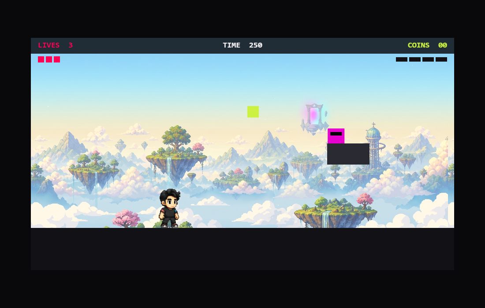

# Gravidade Zero — O Jogo

Platformer pixel-art da marca **Gzero (Gravidade Zero)**: os 5 membros reais do time viram heróis jogáveis, cada um com sua habilidade própria. O superpoder central é o **Humanware** — a tese da marca de que **IA amplifica, não substitui**: ative-o e o personagem ganha um boost temporário que potencializa o que ele já faz bem.



## Controles

| Tecla | Ação |
| --- | --- |
| ← / → | Andar |
| Shift | Correr |
| Espaço | Pular |
| J | Habilidade do personagem |
| H | Humanware |
| Enter | Confirmar |

## Quickstart

```bash
npm install        # instalar dependências
npm run dev        # servidor de desenvolvimento (Vite)
npm run test       # testes unitários (Vitest)
npm run test:e2e   # testes e2e (Playwright)
npm run build      # typecheck + build de produção
```

## Stack

- **Vite + TypeScript + Canvas 2D** — zero dependências de runtime
- **Vitest** — testes unitários
- **Playwright** — testes end-to-end

## Documentação

- [Handoff do projeto](docs/HANDOFF.md)
- [Specs](docs/superpowers/specs/) — [spec mestre](docs/superpowers/specs/2026-06-08-gravidade-zero-game-design.md) · [revisão geral](docs/superpowers/specs/2026-06-09-revisao-geral.md)
