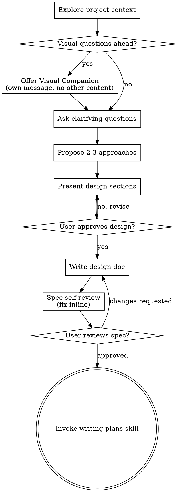
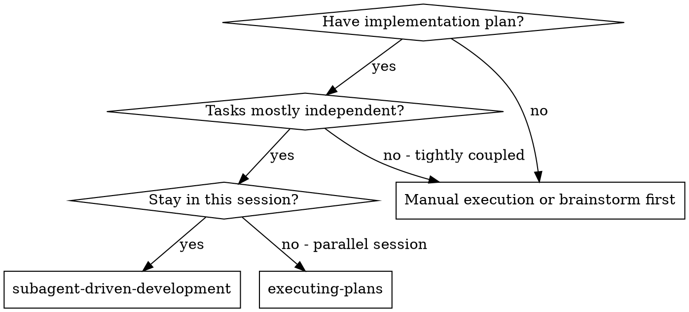
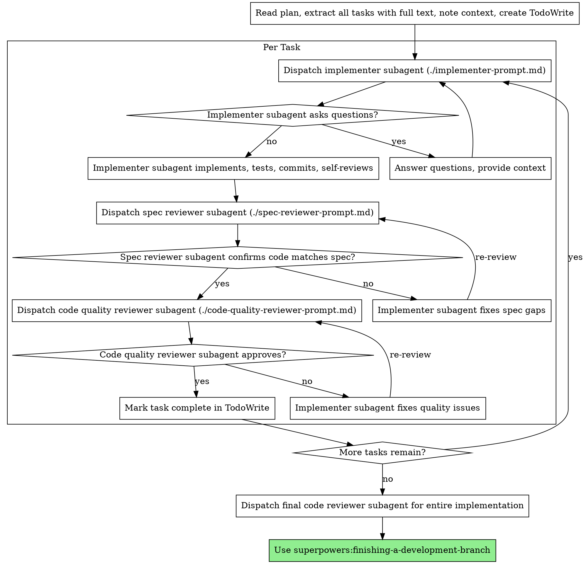

# Transcrição da Sessão — Gravidade Zero (diálogo legível)

> Extraído do log bruto da sessao (f5d20401-…jsonl). Inclui: mensagens reais do usuário + respostas visíveis do assistente + nomes das ferramentas usadas. OMITE: o raciocínio interno (thinking) e os payloads de resultado de ferramenta (enormes). Para o log 100% bruto, ver o .jsonl original.

---


## 👤 Usuário

@"C:\Users\artur\Downloads\remixed-6e07a45d.html"
Encontrei esse artefato publico do claude, o jogo inteiro é só 1 html???

Eu queria utilizar ele como base para criar meu próprio jogo


## 🤖 Assistente

_↳ ferramentas: Bash_


## 🤖 Assistente

_↳ ferramentas: Read_


## 🤖 Assistente

_↳ ferramentas: Read_


## 🤖 Assistente

_↳ ferramentas: Grep_


## 🤖 Assistente

_↳ ferramentas: Read_


## 🤖 Assistente

_↳ ferramentas: Bash_


## 🤖 Assistente

_↳ ferramentas: Grep_


## 🤖 Assistente

I have a clear picture now. Let me check the controls/input handling to complete the understanding.


## 🤖 Assistente

_↳ ferramentas: Grep_


## 🤖 Assistente

Já entendi a estrutura completa do arquivo. Antes de responder sobre como usá-lo como base para o seu jogo — isso é trabalho criativo (criar um jogo novo) — vou invocar a skill de brainstorming, que é o jeito certo de explorar a sua ideia antes de sair codando.


## 🤖 Assistente

_↳ ferramentas: Skill_


## 👤 Usuário

Base directory for this skill: C:\Users\artur\.claude\plugins\cache\claude-plugins-official\superpowers\5.1.0\skills\brainstorming

# Brainstorming Ideas Into Designs

Help turn ideas into fully formed designs and specs through natural collaborative dialogue.

Start by understanding the current project context, then ask questions one at a time to refine the idea. Once you understand what you're building, present the design and get user approval.

<HARD-GATE>
Do NOT invoke any implementation skill, write any code, scaffold any project, or take any implementation action until you have presented a design and the user has approved it. This applies to EVERY project regardless of perceived simplicity.
</HARD-GATE>

## Anti-Pattern: "This Is Too Simple To Need A Design"

Every project goes through this process. A todo list, a single-function utility, a config change — all of them. "Simple" projects are where unexamined assumptions cause the most wasted work. The design can be short (a few sentences for truly simple projects), but you MUST present it and get approval.

## Checklist

You MUST create a task for each of these items and complete them in order:

1. **Explore project context** — check files, docs, recent commits
2. **Offer visual companion** (if topic will involve visual questions) — this is its own message, not combined with a clarifying question. See the Visual Companion section below.
3. **Ask clarifying questions** — one at a time, understand purpose/constraints/success criteria
4. **Propose 2-3 approaches** — with trade-offs and your recommendation
5. **Present design** — in sections scaled to their complexity, get user approval after each section
6. **Write design doc** — save to `docs/superpowers/specs/YYYY-MM-DD-<topic>-design.md` and commit
7. **Spec self-review** — quick inline check for placeholders, contradictions, ambiguity, scope (see below)
8. **User reviews written spec** — ask user to review the spec file before proceeding
9. **Transition to implementation** — invoke writing-plans skill to create implementation plan

## Process Flow



**The terminal state is invoking writing-plans.** Do NOT invoke frontend-design, mcp-builder, or any other implementation skill. The ONLY skill you invoke after brainstorming is writing-plans.

## The Process

**Understanding the idea:**

- Check out the current project state first (files, docs, recent commits)
- Before asking detailed questions, assess scope: if the request describes multiple independent subsystems (e.g., "build a platform with chat, file storage, billing, and analytics"), flag this immediately. Don't spend questions refining details of a project that needs to be decomposed first.
- If the project is too large for a single spec, help the user decompose into sub-projects: what are the independent pieces, how do they relate, what order should they be built? Then brainstorm the first sub-project through the normal design flow. Each sub-project gets its own spec → plan → implementation cycle.
- For appropriately-scoped projects, ask questions one at a time to refine the idea
- Prefer multiple choice questions when possible, but open-ended is fine too
- Only one question per message - if a topic needs more exploration, break it into multiple questions
- Focus on understanding: purpose, constraints, success criteria

**Exploring approaches:**

- Propose 2-3 different approaches with trade-offs
- Present options conversationally with your recommendation and reasoning
- Lead with your recommended option and explain why

**Presenting the design:**

- Once you believe you understand what you're building, present the design
- Scale each section to its complexity: a few sentences if straightforward, up to 200-300 words if nuanced
- Ask after each section whether it looks right so far
- Cover: architecture, components, data flow, error handling, testing
- Be ready to go back and clarify if something doesn't make sense

**Design for isolation and clarity:**

- Break the system into smaller units that each have one clear purpose, communicate through well-defined interfaces, and can be understood and tested independently
- For each unit, you should be able to answer: what does it do, how do you use it, and what does it depend on?
- Can someone understand what a unit does without reading its internals? Can you change the internals without breaking consumers? If not, the boundaries need work.
- Smaller, well-bounded units are also easier for you to work with - you reason better about code you can hold in context at once, and your edits are more reliable when files are focused. When a file grows large, that's often a signal that it's doing too much.

**Working in existing codebases:**

- Explore the current structure before proposing changes. Follow existing patterns.
- Where existing code has problems that affect the work (e.g., a file that's grown too large, unclear boundaries, tangled responsibilities), include targeted improvements as part of the design - the way a good developer improves code they're working in.
- Don't propose unrelated refactoring. Stay focused on what serves the current goal.

## After the Design

**Documentation:**

- Write the validated design (spec) to `docs/superpowers/specs/YYYY-MM-DD-<topic>-design.md`
  - (User preferences for spec location override this default)
- Use elements-of-style:writing-clearly-and-concisely skill if available
- Commit the design document to git

**Spec Self-Review:**
After writing the spec document, look at it with fresh eyes:

1. **Placeholder scan:** Any "TBD", "TODO", incomplete sections, or vague requirements? Fix them.
2. **Internal consistency:** Do any sections contradict each other? Does the architecture match the feature descriptions?
3. **Scope check:** Is this focused enough for a single implementation plan, or does it need decomposition?
4. **Ambiguity check:** Could any requirement be interpreted two different ways? If so, pick one and make it explicit.

Fix any issues inline. No need to re-review — just fix and move on.

**User Review Gate:**
After the spec review loop passes, ask the user to review the written spec before proceeding:

> "Spec written and committed to `<path>`. Please review it and let me know if you want to make any changes before we start writing out the implementation plan."

Wait for the user's response. If they request changes, make them and re-run the spec review loop. Only proceed once the user approves.

**Implementation:**

- Invoke the writing-plans skill to create a detailed implementation plan
- Do NOT invoke any other skill. writing-plans is the next step.

## Key Principles

- **One question at a time** - Don't overwhelm with multiple questions
- **Multiple choice preferred** - Easier to answer than open-ended when possible
- **YAGNI ruthlessly** - Remove unnecessary features from all designs
- **Explore alternatives** - Always propose 2-3 approaches before settling
- **Incremental validation** - Present design, get approval before moving on
- **Be flexible** - Go back and clarify when something doesn't make sense

## Visual Companion

A browser-based companion for showing mockups, diagrams, and visual options during brainstorming. Available as a tool — not a mode. Accepting the companion means it's available for questions that benefit from visual treatment; it does NOT mean every question goes through the browser.

**Offering the companion:** When you anticipate that upcoming questions will involve visual content (mockups, layouts, diagrams), offer it once for consent:
> "Some of what we're working on might be easier to explain if I can show it to you in a web browser. I can put together mockups, diagrams, comparisons, and other visuals as we go. This feature is still new and can be token-intensive. Want to try it? (Requires opening a local URL)"

**This offer MUST be its own message.** Do not combine it with clarifying questions, context summaries, or any other content. The message should contain ONLY the offer above and nothing else. Wait for the user's response before continuing. If they decline, proceed with text-only brainstorming.

**Per-question decision:** Even after the user accepts, decide FOR EACH QUESTION whether to use the browser or the terminal. The test: **would the user understand this better by seeing it than reading it?**

- **Use the browser** for content that IS visual — mockups, wireframes, layout comparisons, architecture diagrams, side-by-side visual designs
- **Use the terminal** for content that is text — requirements questions, conceptual choices, tradeoff lists, A/B/C/D text options, scope decisions

A question about a UI topic is not automatically a visual question. "What does personality mean in this context?" is a conceptual question — use the terminal. "Which wizard layout works better?" is a visual question — use the browser.

If they agree to the companion, read the detailed guide before proceeding:
`skills/brainstorming/visual-companion.md`


## 🤖 Assistente

Perfeito, já li o arquivo inteiro e entendi a estrutura. Deixa eu responder a sua pergunta primeiro e depois a gente parte pra construir o seu.

## Sim — o jogo inteiro é 1 arquivo HTML só 🎮

O arquivo é o **「リーフのだいぼうけん」** (*"A Grande Aventura do Leaf"*) — um **platformer estilo Mario**, feito em JavaScript puro. Ele tem 601 KB e 1.104 linhas, e está dividido em 4 partes, todas dentro do mesmo arquivo:

| Parte | Onde | O que é |
|-------|------|---------|
| **HTML** | linhas 1–209 | O `<canvas id="game">` (a tela onde o jogo é desenhado) + as telas de menu, vitória e game over |
| **CSS** | dentro do `<style>` (10–144) | Todo o visual: estilo retrô, "scanlines" de TV antiga, botões, fontes |
| **JavaScript** | dentro do `<script>` (210–1104) | O **motor do jogo inteiro** — física, inimigos, moedas, câmera... tudo em JS puro, **sem React e sem bibliotecas** |
| **Arte (imagens)** | linhas 219–221 | Os sprites e o fundo embutidos como texto **base64** (`ATLAS_SRC` = PNG dos personagens, `BG_SRC` = JPEG do céu). **É isso que faz o arquivo ser "pesado".** |

O único recurso externo é o link das fontes do Google (linha 9). Tirando isso, é **100% autossuficiente**: abre em qualquer navegador, sem instalar nada, sem servidor. Esse é exatamente o formato padrão de um **artefato do Claude** — tudo embutido num arquivo só pra rodar isolado.

**O motor já vem com:** física de pulo/corrida, níveis feitos de "tiles" (blocos), inimigos, moedas, power-up de estrela (invencibilidade), tiro, partículas, câmera que segue o personagem, e **controles de teclado + toque** (já funciona no celular).

👉 **Boa notícia pra você:** esse formato é *ótimo* como base. Dá pra copiar o arquivo, abrir e ir modificando aos poucos, vendo o resultado na hora no navegador.

---

Agora, pra eu te ajudar a criar **o seu** jogo a partir dele, preciso entender o que você tem em mente. A primeira decisão é a mais importante porque muda tudo:

**O que você quer fazer com essa base?**

- **A) "Reskin" / personalizar este mesmo jogo** — manter o platformer (pulo, inimigos, fases), mas trocar o visual, os personagens, as fases e talvez ajustar regras. *Mais rápido, ótimo pra aprender mexendo.*
- **B) Platformer próprio, mais ambicioso** — manter o motor, mas mudar bastante: novas mecânicas (chefões, habilidades, itens diferentes), fases novas, história própria.
- **C) Um gênero totalmente diferente** — usar só a "estrutura" (1 HTML + canvas + loop de jogo) como molde, mas fazer outra coisa (ex: jogo de nave, puzzle, top-down estilo Zelda, corrida...).

Qual desses chega mais perto da sua ideia? (E se já tiver um tema/conceito na cabeça — tipo "queria um jogo do meu mascote", "um jogo espacial", etc. — me conta junto.)


## 👤 Usuário

A + B


## 🤖 Assistente

Boa escolha — manter o motor do platformer (pulo, física, fases, inimigos) e tornar ele seu, com visual novo **e** mecânicas novas. Dá pra fazer de forma incremental, o que é perfeito pra aprender mexendo.

Antes de eu começar a fazer perguntas sobre a sua ideia, uma coisa:

Boa parte do que a gente vai discutir (visual dos personagens, paleta de cores, layout das fases, telas do jogo) costuma ficar **mais fácil de decidir vendo do que lendo**. Eu consigo montar mockups, comparações lado a lado e diagramas num navegador, ao vivo, enquanto a gente conversa. Esse recurso ainda é novo e consome bastante token. Quer experimentar? *(Precisa abrir uma URL local no seu navegador.)*

Se preferir, seguimos só no texto mesmo — funciona bem também.


## 👤 Usuário

Faça


## 🤖 Assistente

Vou ler o guia do companion visual antes de iniciar.


## 🤖 Assistente

_↳ ferramentas: Read_


## 🤖 Assistente

O usuário aceitou. Vou inspecionar o script do servidor e o ambiente antes de subir (estou no Windows, então preciso checar dependências e o modo de execução).


## 🤖 Assistente

_↳ ferramentas: Read_


## 🤖 Assistente

_↳ ferramentas: Bash_


## 🤖 Assistente

Node 22 disponível e ambiente MINGW (vai rodar em foreground, então uso background no Bash tool). Deixa eu confirmar como o servidor publica a info de conexão antes de subir.


## 🤖 Assistente

_↳ ferramentas: Bash_


## 🤖 Assistente

Node grava o `server-info` ao subir. No Windows preciso passar um caminho que o Node entenda (forma `C:/...`, não `/c/...`). Subindo o servidor em background:


## 🤖 Assistente

_↳ ferramentas: Bash_


## 🤖 Assistente

_↳ ferramentas: Bash_


## 🤖 Assistente

O servidor está no ar 🎉

**Abra no navegador:** http://localhost:59577

Servidor ativo. Agora a primeira decisão — e essa é melhor *vendo* do que lendo. Vou montar direções de tema/visual pra você comparar.


## 🤖 Assistente

_↳ ferramentas: Write_


## 🤖 Assistente

No navegador (http://localhost:59577) aparecem **4 direções de tema/visual** lado a lado, cada uma com sua paleta de cores:

- 🍃 **Floresta Encantada** — aconchegante, perto do original
- 🚀 **Espaço / Sci-fi** — neon, planetas, robôs
- 🍭 **Mundo dos Doces** — fofo, pastel, colorido
- 🗡️ **Masmorra Sombria** — gótico, tenso, mais "hardcore"

Dá uma olhada e clica na que mais te agrada (ou em duas, se quiser misturar). **Se nenhuma fechou**, me conta aqui no terminal quem é o herói, onde se passa e qual o clima que você imagina — a ideia é a base, não uma camisa de força.


## 👤 Usuário

Eu queria personalizado da empresa, Gzero, as cores costumam ser preto e um magenta, busque o que tenho sobre gravidade zero em akasha

Minha ideia é criar sprites dos membros da gzero, criar mapas relacionados, inimigos, etc.. 
Quero personalizar bem, criar mecanicas, super poder humanware, etc..

Quero criar assets com o higgsfield, acho que é possível


## 🤖 Assistente

Ótimo brief — agora ficou concreto: jogo da **Gzero** (Gravidade Zero), paleta **preto + magenta**, sprites dos membros reais da equipe, mapas/inimigos temáticos, mecânicas novas (incluindo um superpoder "**humanware**"), e assets gerados via **Higgsfield**.

Você me pediu pra buscar o que você tem sobre "gravidade zero" no **akasha** — vou fazer isso agora, e de quebra checar se o Higgsfield está disponível pra geração de assets. Deixa eu carregar essas ferramentas.


## 🤖 Assistente

_↳ ferramentas: ToolSearch_


## 🤖 Assistente

_↳ ferramentas: ToolSearch_


## 🤖 Assistente

Ferramentas carregadas. Confirmo já: o **Higgsfield está disponível** e suporta exatamente o que você quer — inclusive "Soul Characters" (treina um personagem reutilizável com 5–20 fotos), ideal pra gerar sprites consistentes dos membros reais da Gzero.

Agora vou buscar no **akasha** o que você tem sobre Gravidade Zero / Gzero (e o conceito "humanware"), e checar seu saldo no Higgsfield:


## 🤖 Assistente

_↳ ferramentas: mcp__akasha__akasha_brainstorm_


## 🤖 Assistente

_↳ ferramentas: mcp__akasha__akasha_brainstorm_


## 🤖 Assistente

_↳ ferramentas: mcp__c4a448d9-c062-4e07-b3da-5ffb71cd4999__balance_


## 🤖 Assistente

O akasha trouxe ótimo material. Antes de sintetizar, deixa eu (1) localizar o vault no disco pra ler os docs de marca completos (cores exatas, doutrina) e (2) buscar especificamente os **membros da equipe**. (O saldo do Higgsfield deu erro transitório — checo de novo na hora de gerar.)


## 🤖 Assistente

_↳ ferramentas: Glob_


## 🤖 Assistente

_↳ ferramentas: mcp__akasha__akasha_brainstorm_


## 🤖 Assistente

O Glob no disco inteiro estourou o tempo, e o akasha mostrou que **a equipe não está indexada** (só apareceram clientes: Ricardo Almeida, Natura, Motiva, EcoRodovias). Vou localizar o vault de forma mais cirúrgica pra ler os tokens exatos de marca:


## 🤖 Assistente

_↳ ferramentas: Bash_


## 🤖 Assistente

Achei o essencial. Dois tesouros:
1. **Vault** em `C:/Users/artur/vault` (tem `entities/`, `concepts/`).
2. **Pasta da Gzero no Desktop** com `Diretriz_Design_Gzero/`, `Logo_Gzero_vetores/`, `HUMANO/`, `Higgsfield/`, `Ai_Fluency/` — ou seja, você já tem os assets de marca e até uma pasta Higgsfield aqui.

Deixa eu mapear esses conteúdos:


## 🤖 Assistente

_↳ ferramentas: Bash_


## 🤖 Assistente

O vault e a pasta no Desktop têm tudo. Destaques: `Diretriz_Design_Gzero/` tem **BRAND.md, DESIGN.md, tokens.css** (cores exatas!) + os **vetores SVG do logo**, e a pasta **Higgsfield/Selfies/** provavelmente tem fotos de referência da equipe (vejo "Julio" e "Artur" em vários arquivos). Os conceitos `ai-fluency-axis-model` e `human-3-0-model` definem o **humanware**. Vou ler o essencial:


## 🤖 Assistente

_↳ ferramentas: Read_


## 🤖 Assistente

_↳ ferramentas: Read_


## 🤖 Assistente

Achei o sistema de marca **exato**. Isso muda o visual do reskin de forma importante:

- **Cores:** Pink operacional `#ff0055`, Magenta Classic (heritage) `#f43db3`, preto `#050505`, superfícies dark `#09090b`/`#121216`.
- **Linguagem "Tech-Noir":** **cantos quadrados** (radius 0), **sombras duras com offset** (`4px 4px 0`, sem blur), fontes **Outfit** (títulos) + **Inter** + **mono UPPERCASE** pra labels. Sóbrio.
- **Logo:** vetores SVG prontos (logo "GERZO", favicon "G0" branco pra fundo escuro, letras individuais) — dá pra usar como assets do jogo.

Curiosidade boa: pixel art já é quadrado por natureza, então combina perfeitamente com o radius-0 da Gzero. Magenta-neon sobre preto = visual coeso.

Agora os 2 últimos pontos antes de eu sintetizar: o conceito **humanware** (pro superpoder) e as **fotos da equipe** pra Higgsfield:


## 🤖 Assistente

_↳ ferramentas: Read_


## 🤖 Assistente

_↳ ferramentas: Read_


## 🤖 Assistente

_↳ ferramentas: Bash_


## 🤖 Assistente

Achei tudo que precisava. **Síntese do que você tem (e que vamos usar):**

**🎨 Marca (de `Diretriz_Design_Gzero/`):** preto `#050505` + pink `#ff0055` (ação) + magenta-classic `#f43db3` (heritage). Estética **Tech-Noir**: quadrado, sombras duras, Outfit/Inter/mono. Logo "GERZO" e favicon "G0" em SVG prontos.

**🧠 "Humanware" (de `ai-fluency-axis-model`):** é o **eixo mais pesado (22%)** do modelo da Gzero — mede **julgamento humano, risco, governança, validação, autoridade**. A doutrina é "*IA amplifica, não substitui; o humano é a fonte de autoridade*". Isso dá um superpoder **excelente**: não é um "tiro" comum — é um **modo meta** que o humano carrega e que amplifica/sobrepõe tudo (ex: desacelerar o tempo, revelar o que é fake, dominar inimigos). Totalmente on-brand.

**👤 Equipe pra sprites:** a pasta `Higgsfield/Selfies/` tem **17 fotos** (2026-05-31) — exatamente o material pra treinar "Soul Characters" no Higgsfield. Vejo forte presença do **"Julio"** (pitch/podcast) e você, **Artur**.

> ⚠️ Um detalhe de viabilidade que vou detalhar depois: o Higgsfield gera *imagens* lindas, mas transformar isso num *sprite sheet* de jogo (frames pequenos, fundo transparente, animação de andar/pular) exige um passo de pipeline. É possível — só quero te mostrar as opções na hora certa.

Antes de eu propor a arquitetura do jogo, **uma pergunta** que define o tamanho de tudo:

**Qual é o objetivo desse jogo?**

- **A) Protótipo rápido / brincadeira** — reskin enxuto, 1 fase, só pra ver a Gzero virar jogo. *(horas)*
- **B) Peça de marketing jogável** — polido pra site/redes/eventos: 2–3 fases, membros como personagens, superpoder humanware, tela inicial com a marca. *(dias)*
- **C) Projeto sério e expansível** — base robusta pra crescer: vários personagens jogáveis, chefões, progresso, talvez editor de fases. *(semanas)*

Qual chega mais perto? (Pode ser um meio-termo — me diz com suas palavras.)


## 👤 Usuário

https://www.gravidadezero.space/ Quero que leia as páginas desse site, todas elas, contém muita informação sobre a empresa


## 🤖 Assistente

_↳ ferramentas: Bash_


## 🤖 Assistente

O sitemap revelou a estrutura. São **~370 URLs**, mas a maioria esmagadora (≈350) são páginas **templadas de resultado por pessoa** sob clientes (`/vivo-ia/...`, `/kion/...`, `/ecorodovias/...`, `/mubadala/...`, `/vivo-lojas/...`, `/jpmorgan/...`) — são participantes dos *assessments* dos clientes, **não** info da empresa, e são repetitivas.

A informação real **sobre a empresa** está em ~20 páginas de conteúdo (sobre, humanware, o-que-é-gravidade-zero, soluções, cases, liderança, cultura, etc.). Meu plano: **ler todas essas a fundo**, **amostrar** uma página por cliente (pra entender o produto), e **não** rastejar as 350 idênticas (te aviso disso explicitamente — se quiser uma lista de cliente inteira depois, eu puxo).

Antes de disparar a leitura em paralelo, um preflight rápido pra confirmar que o conteúdo vem no HTML (site Next/Vercel pode ser só "casca" JS):


## 🤖 Assistente

_↳ ferramentas: Bash_


## 🤖 Assistente

Confirmado: as páginas servem conteúdo real no HTML (7–8 mil palavras cada), então a leitura vai funcionar. E já apareceu algo importante: **"Humanware®" é marca registrada da Gzero**, e a voz pública do site é mais **filosófica/regenerativa** ("criar futuros regenerativos… responder à complexidade com reinvenção") — diferente do tom sóbrio do produto. Tudo isso vira material de lore.

Ultracode está ligado, então vou disparar um **workflow** que lê as ~26 páginas de conteúdo em paralelo, extrai dados estruturados de cada uma e sintetiza um **dossiê da empresa orientado ao jogo** (quem é a Gzero, doutrina humanware, soluções, cases, pessoas, voz, e ganchos de lore pro jogo).


## 🤖 Assistente

_↳ ferramentas: Workflow_


## 🤖 Assistente

Workflow disparado em background (Run ID `wf_897d0d69-e5d`). Ele está lendo as **26 páginas de conteúdo** em paralelo, extraindo dados estruturados de cada uma e depois sintetizando o dossiê.

Você pode acompanhar ao vivo com `/workflows`. Vou ser avisado quando terminar e aí te entrego o **dossiê da empresa orientado ao jogo** — incluindo separação entre **time Gzero × participantes de cliente** (pra sabermos quem vira personagem jogável) e os **ganchos de lore** (herói, superpoder humanware, inimigos, mundos). Já volto com isso.


_↳ [workflow/tarefa em background concluído]_


## 🤖 Assistente

The workflow ran but read **0 pages** — `attempted:0` reveals the bug: I passed `args` as a JSON *string* instead of an actual object, so `args.core` was undefined inside the script and no URLs got fetched. (The synthesis agent improvised by reading your local repo instead — interesting, but not what you asked for: it even missed that Kion/EcoRodovias/JPMorgan are real client engagements, which only the *website* knows.)

Re-launching the same script with `args` passed correctly as an object:


## 🤖 Assistente

_↳ ferramentas: Workflow_


## 🤖 Assistente

Re-disparado corretamente (Run ID `wf_53a6a18e-eaa`) — agora os 26 leitores de página vão de fato buscar as URLs. Acompanhe com `/workflows`; volto com o dossiê assim que terminar.


_↳ [workflow/tarefa em background concluído]_


## 🤖 Assistente

Mesmo erro: `attempted:0` de novo — o `args` chegou ao script como **string**, não objeto (o ambiente está serializando o parâmetro apesar de eu mandar como objeto). E o agente de síntese mais uma vez "salvou o dia" lendo seus arquivos locais — útil, mas **não é o site** que você pediu.

Chega de depender de `args`. Vou **embutir as 26 URLs direto no script** (à prova de bug) e adicionar uma trava: se nenhuma página for lida, ele aborta em vez de inventar a partir de arquivos locais. Reescrevendo e disparando fresh:


## 🤖 Assistente

_↳ ferramentas: Workflow_


## 🤖 Assistente

Agora com as 26 URLs embutidas no script (sem depender de `args`) e uma trava anti-improviso. Run ID `wf_869e2f77-be4` — desta vez os 26 leitores vão rodar de verdade. Volto com o dossiê quando terminar.


_↳ [workflow/tarefa em background concluído]_


## 🤖 Assistente

O workflow funcionou: **26/26 páginas lidas**, 27 agentes, 1.29M tokens. A homepage já revela material riquíssimo (a voz pública é *bem* diferente do BRAND.md sóbrio — é cósmica/regenerativa/"louCURA"). Deixa eu extrair o dossiê sintetizado do arquivo de resultado:


## 🤖 Assistente

_↳ ferramentas: Bash_


## 🤖 Assistente

_↳ ferramentas: Bash_


## 🤖 Assistente

O resultado está aninhado em `.result` (e os logs confirmam: **26/26 páginas, 0 erros**). Extraindo o dossiê:


## 🤖 Assistente

_↳ ferramentas: Bash_


## 🤖 Assistente

Dossiê completo e excelente. Vou **persistir no projeto** (não quero perder 1.3M tokens de pesquisa em arquivo temporário) e já te mostro a decisão visual no navegador:


## 🤖 Assistente

_↳ ferramentas: Bash_


## 🤖 Assistente

Salvo em [docs/gzero-site-dossier.md](docs/gzero-site-dossier.md) e [docs/gzero-site-pages.json](docs/gzero-site-pages.json). Agora a comparação visual no navegador:


## 🤖 Assistente

_↳ ferramentas: Write_


## 🤖 Assistente

Li o site inteiro (26 páginas). **A grande descoberta:** existem *duas* Gzeros, e isso muda o jogo.

**🌌 Marca pública (gravidadezero.space):** um coletivo de transformação "cósmico/regenerativo" — *"criar futuros regenerativos é responder à complexidade com reinvenção"*. Fundadores **Renan Hannouche & Dante Freitas** (se conheceram num programa da NASA), IA-mascote **"Renante"** (Renan+Dante). E o melhor: **a marca JÁ é um RPG** — eles chamam os perfis de assessment de **"Lifecards"** com **"LVL MAX", "Super Skills", "MISSÃO IA"**. Praticamente um presente pra fazer um jogo.

**⚫ Marca de produto (BRAND.md local):** o "Tech-Noir" sóbrio, preto + pink `#ff0055`. É a cara dos *assessments* de AI Fluency.

**🧠 Humanware®** (no site): *"as tecnologias nativas humanas; o caminho do coração como único possível pra uma vida plena"*. Casa perfeitamente com o superpoder — um medidor de "coração/consciência" que **transforma ferramenta em potência** (*"um tolo com uma ferramenta continua sendo um tolo"*). E **IA amplifica, não substitui** → o companheiro Renante só *amplifica* seus movimentos, nunca age sozinho.

**🎮 Lore pronto:** mundo esmagado pela "gravidade" da complexidade → você entra em **Gravidade Zero** (sem peso, portais, plataformas flutuantes) → restaura zonas até atingir a **Consciência Unificada**. Inimigos: "O Tolo com a Ferramenta", poços de gravidade, "Skill Gaps", e a **Esfinge** do `/cases` ("decifra-me ou te devoro"). Coletáveis: 3 fragmentos (Existencial+Cultural+Digital).

> Dossiê completo salvo em [docs/gzero-site-dossier.md](docs/gzero-site-dossier.md). ⚠️ Uma divergência importante: o site diz que os fundadores são **Renan & Dante**, mas seus arquivos locais destacam um **"Julio"** no pitch. Vou precisar saber **quem** são os membros jogáveis — já já chego nisso.

---

**No navegador (http://localhost:59577)** mostrei as **3 direções visuais** com as paletas reais. Qual vira o jogo?

- **A · Cósmico** (neon sobre preto, já-RPG) · **B · Tech-Noir** (sóbrio, preto+pink) · **C · Híbrido — recomendado** (base preto+magenta + neons como destaque; lore cósmico/RPG + precisão do produto)

Clica na sua preferida (ou me diz). **Depois disso**, só faltam 2 decisões rápidas pra eu fechar o design: **(1) o escopo** (protótipo / peça de marketing / projeto sério) e **(2) quais membros viram personagens jogáveis**.


_↳ [workflow/tarefa em background concluído]_


## 🤖 Assistente

📡 Aviso rápido: o servidorzinho do companion visual hibernou por inatividade (rodou e saiu com código 0). A tela das 3 direções deve continuar visível no painel de preview, mas **clicar pra selecionar pode não registrar** — então é só me dizer aqui no terminal. Quando a gente chegar na próxima etapa visual (estilo dos sprites / roster dos personagens) eu relanço o navegador.

Sem pressa — quando puder, me responde:

1. **Direção visual:** **A** (cósmico) · **B** (tech-noir) · **C** (híbrido, recomendado)?
2. **Escopo:** protótipo rápido · peça de marketing jogável · projeto sério/expansível?
3. **Personagens jogáveis:** quem? (Renan & Dante? Julio? Você, Artur? O time das selfies?) — e o "Renante" como companheiro que *amplifica* seus movimentos faz sentido pra você?


## 👤 Usuário

localhost não está no ar


## 🤖 Assistente

O servidor hibernou — vou relançar. Ele cria uma sessão nova (porta nova), então depois copio a tela atual pra lá e te passo o link.


## 🤖 Assistente

_↳ ferramentas: Bash_


## 🤖 Assistente

_↳ ferramentas: Bash_


## 🤖 Assistente

No ar de novo 👉 **http://localhost:63692** (porta nova). A tela das **3 direções visuais** (A cósmico · B tech-noir · C híbrido) já está carregada lá.

Dá uma olhada e me responde (clica ou escreve aqui):

1. **Direção visual** — A, B ou **C (recomendada)**?
2. **Escopo** — protótipo rápido · peça de marketing jogável · projeto sério?
3. **Personagens jogáveis** — quem? (Renan & Dante? Julio? você? o time das selfies?)


## 👤 Usuário

Direção C

Projeto sério mas interno a principio. Para diversão do grupo.

Personagens jogaveis: renan, dante, julio, eu e einstein(pai de renan)


## 🤖 Assistente

Fechado, anotando as decisões:

- **Visual: C (Híbrido)** — base preto + magenta, neons como destaque, lore cósmico/RPG, pixel art quadrado.
- **Escopo: projeto sério e expansível, mas interno** (diversão do grupo). → Tradução prática: arquitetura limpa e fácil de crescer, mas **continua sendo 1 HTML autossuficiente** (pra você mandar o arquivo no grupo e todo mundo abrir e jogar, sem instalar nada). E como é interno/informal, **podemos ser brincalhões** (zoeira interna, in-jokes) sem as regras sóbrias da marca de produto.
- **Roster (5 jogáveis):** **Renan, Dante, Julio, Artur (você)** e **Einstein** (pai do Renan — já imagino cabelo branco + óculos, o "gênio/mentor"). Tela de seleção de personagem, cada um com uma habilidade distinta. *(O "Renante", a IA, entra como companheiro opcional que só **amplifica** seus movimentos — fiel à doutrina "IA amplifica, não substitui". Topa?)*

Antes de eu escrever o design completo, falta **a decisão mais importante de viabilidade: como fazer os sprites** dos 5 personagens. Isso define esforço e o "uau". Três caminhos:

**1) Caras reais 100% em pixel (Higgsfield full)**
Cada selfie → Higgsfield gera o personagem pixelado + poses (andar/pular) → monto a folha de sprites.
✅ Máximo "uau", rostos reconhecíveis. ❌ Consistência entre frames é o ponto difícil da IA; exige pós-processamento (recortar fundo, padronizar tamanho/paleta). Mais trabalho por personagem.

**2) Híbrido retrato + corpo pixel — RECOMENDADO**
Higgsfield gera **um retrato/key-art** estiloso por personagem (pra tela de seleção, vitória, HUD). No gameplay, sprites num estilo pixel **consistente**: mesmo corpo-base, cores por pessoa + o traço marcante de cada um (Einstein = cabelo branco/óculos; etc.). A animação já é feita em código pelo motor.
✅ Melhor equilíbrio: reconhecível + consistente + esforço controlado + escala fácil pra novos personagens. ❌ No gameplay não é fotorrealista (mas pixel art não deveria ser mesmo).

**3) Tudo em código/geométrico (rápido, menos fiel)**
Personagens montados por código (formas + paleta + acessório marcante). Higgsfield só pra arte das telas.
✅ Rápido, leve, 100% consistente. ❌ Menos "uau", menos fiel aos rostos.

Eu recomendo a **2**. E posso **de-riscar agora**: rodar um **teste real no Higgsfield** — gerar 1 sprite a partir de um dos selfies — pra você ver o estilo antes de fechar. Isso **gasta créditos** (faço um *preflight* de custo primeiro, sem cobrar). Quer que eu faça o teste? E qual das 3 abordagens te agrada?


## 👤 Usuário

2

Eu tenho uma pasta cheia de selfies em C:\Users\artur\Área de Trabalho\Artur-Fotos-Avatar


## 🤖 Assistente

Perfeito — **abordagem 2** travada, e essa pasta de selfies é ideal pra começar pelo **seu** personagem (Artur). Pros outros 4 (Renan, Dante, Julio, Einstein) a gente vê as referências depois — parte já deve estar em `Higgsfield/Selfies/`.

Vou: (1) listar suas fotos, (2) carregar as ferramentas de upload do Higgsfield e (3) pedir ao Higgsfield a recomendação de modelo pra "sprite pixel a partir de selfie":


## 🤖 Assistente

_↳ ferramentas: Bash_


## 🤖 Assistente

_↳ ferramentas: ToolSearch_


## 🤖 Assistente

_↳ ferramentas: mcp__c4a448d9-c062-4e07-b3da-5ffb71cd4999__models_explore_


## 🤖 Assistente

100 selfies — material de sobra. Modelo recomendado: **soul_2** (Higgsfield) e **nano_banana_pro** (Google, image-to-image, ótimo pra *transformar* a foto em estilo pixel preservando o rosto — melhor pro nosso caso). Vou ver algumas fotos pra escolher uma frontal/nítida como referência do teste:


## 🤖 Assistente

_↳ ferramentas: Read_


## 🤖 Assistente

_↳ ferramentas: Read_


## 🤖 Assistente

_↳ ferramentas: Read_


## 🤖 Assistente

_↳ ferramentas: Read_


## 🤖 Assistente

Boa — tenho referências ótimas. Vou usar **duas** como referência pro `nano_banana_pro` (ele aceita múltiplas): uma de **corpo inteiro frontal** (20.38.08) pra pose/proporção e uma de **rosto em close** (20.38.36) pra fidelidade facial (cabelo escuro ondulado, sobrancelhas marcantes, olhos castanhos).

Características que vou pedir pra preservar: jovem, magro, cabelo castanho-escuro, sobrancelhas grossas, leve barba por fazer, camiseta preta.

Primeiro passo (sem custo): subir as duas referências pro Higgsfield.


## 🤖 Assistente

_↳ ferramentas: mcp__c4a448d9-c062-4e07-b3da-5ffb71cd4999__media_upload_


## 🤖 Assistente

O upload falhou ("Something went wrong") — e o saldo também tinha falhado antes. Pode ser instabilidade do servidor do Higgsfield ou um problema na conta. Vou tentar de novo e checar o saldo em paralelo pra diagnosticar:


## 🤖 Assistente

_↳ ferramentas: mcp__c4a448d9-c062-4e07-b3da-5ffb71cd4999__media_upload_


## 🤖 Assistente

_↳ ferramentas: mcp__c4a448d9-c062-4e07-b3da-5ffb71cd4999__balance_


## 🤖 Assistente

`models_explore` funcionou (catálogo é público), mas **balance e upload falham** — isso cheira a **workspace não selecionado** ou sessão não autenticada no Higgsfield (operações de conta exigem isso; o catálogo não). Vou listar/selecionar workspace e tentar de novo:


## 🤖 Assistente

_↳ ferramentas: ToolSearch_


## 🤖 Assistente

_↳ ferramentas: mcp__c4a448d9-c062-4e07-b3da-5ffb71cd4999__list_workspaces_


## 🤖 Assistente

Tentei de novo e também falhou. Diagnóstico: **todas as operações de conta do Higgsfield falham** (`balance`, `media_upload`, `list_workspaces` — todas com "Something went wrong" + Request ID), mas o catálogo público (`models_explore`) funciona. Isso é um **problema de autenticação/sessão do conector Higgsfield** (ou instabilidade no backend deles) — não é algo que eu resolva daqui, e insistir só vira spam.

**O que fazer:** reconectar/reautenticar a integração do Higgsfield no Claude (ou tentar mais tarde). **Mas isso NÃO trava nada** — o teste de sprite era só validação; a decisão de pipeline (abordagem 2) está de pé, e dá até pra construir o jogo com personagens "placeholder" desenhados em código e **trocar pela arte do Higgsfield depois**, quando a conta voltar.

Tenho **tudo** que preciso pro design. Deixa eu fechar a proposta:


## 🤖 Assistente

_↳ ferramentas: mcp__ccd_session__mark_chapter_


## 🤖 Assistente

# 🎮 Proposta de Design — *Gravidade Zero: O Jogo* (nome provisório)

## 1. Conceito & objetivo
O mundo foi esmagado pela **"gravidade"** — o peso da complexidade, da cultura morta e da automação sem alma. Você entra em **Gravidade Zero**: um reino sem peso, de plataformas flutuantes e **portais**. Missão: atravessar as fases, reparar o que foi ferido e reunir as **3 Transformações** (Existencial + Cultural + Digital) até atingir a **Consciência Unificada** e devolver leveza ao mundo. Tela de vitória: *"Você também acredita que podemos mudar o mundo? Bora juntos."*

## 2. Arquitetura técnica (sério, mas continua **1 HTML**)
Mantemos o trunfo da base: **um único arquivo autossuficiente** (você manda no grupo, todo mundo abre e joga). Mas refatoro o motor pra ser **data-driven e expansível**:
- `CHARACTERS` — registro de personagem (nome, paleta, habilidade, retrato). *Adicionar herói = adicionar um item de dado.*
- `LEVELS` — fases como dados (mapa em texto/grid). *Nova fase = novo dado, sem mexer no motor.*
- `ASSETS` — manifesto de sprites/retratos (base64 embutido).
- Sistemas isolados: física (reaproveitada), inimigos, **Modo Humanware**, habilidades, HUD/marca, telas.

## 3. Personagens jogáveis (5 + companheiro)
Tela de seleção; cada um com **1 habilidade única** (provisórias — ajusta à vontade):
- **Renan** — *Salto Visionário* (pulo mais alto, enxerga portais/segredos).
- **Dante** — *Dash Criativo* (corrida-investida que quebra obstáculos).
- **Julio** — *Escudo de Governança* (bloqueia dano; fiel ao "critério/guardrails").
- **Artur (você)** — *Builder* (cria uma plataforma/ferramenta temporária).
- **Einstein** (pai do Renan, o gênio — cabelo branco + óculos) — *E=mc²* (desacelera o tempo).
- **Renante** (a IA) — **companheiro opcional** que só **amplifica** sua habilidade atual (nunca age sozinho — "IA amplifica, não substitui").

## 4. Superpoder **Humanware** (mecânica central, igual pra todos)
Um medidor de **coração/consciência** que enche ao coletar e agir bem. Cheio, ativa o **Modo Humanware** (o *"caminho do coração"*): por alguns segundos o mundo desacelera, os inimigos "Tolo" congelam, e suas ferramentas viram **potência** (ataque/pulo turbinados). Lema embutido: *"um tolo com uma ferramenta continua sendo um tolo — é o estado de consciência que transforma tecnologia em potência."*

## 5. Inimigos & obstáculos
- **O Tolo com a Ferramenta** — inimigo básico (congela no Modo Humanware).
- **Poços de Gravidade** — puxam você pra baixo.
- **Skill Gaps** — buracos nas plataformas (habilidades que faltam).
- **Boss: A Esfinge** (*"decifra-me ou te devoro"*) — porta-enigma; e o chefão final **A Gravidade / Status Quo**.

## 6. Mundos (expansível — começamos com 1, estrutura aguenta vários)
Um mundo por pilar de conteúdo: **Humanware** (MVP) → IA & Tecnologia → Futuro do Trabalho → Liderança (Liderando no Caos) → Cultura (organismo vivo). **Fases-desafio "MISSÃO IA"** dos clientes (Vivo, Kion, Ecorodovias, Mubadala, JPMorgan) como estágios bônus/chefe. Especial: **Vale do Silício**.

## 7. Coletáveis & progressão
- **Super Skills / data-points** (as moedas reskinadas).
- **3 Fragmentos de Transformação** → combinam na **Consciência Unificada** (condição de vitória).
- **Lifecards** — coletar a Lifecard de alguém **desbloqueia aquele personagem** jogável.
- **Playbooks** — power-ups.

## 8. Visual / HUD / marca (direção C)
Fundo preto/espaço + **magenta** como cor de ação, com **neons** (azul `#0099ff`, lima `#cdf140`, violeta) como destaques. Pixel art quadrado. HUD em **mono UPPERCASE**, títulos em **Outfit**. Logo "G0" e os vetores SVG entram nas telas (título/seleção/vitória). Porta de fim de fase = **portal**.

## 9. Pipeline de arte (abordagem 2)
Por personagem: 1 **retrato key-art** (Higgsfield, pra seleção/HUD/vitória) + **corpo pixel consistente** (mesma base, paleta + traço marcante por pessoa). **Construímos com placeholders em código primeiro** (joga já), e trocamos pela arte do Higgsfield quando a conta voltar.

---

Esse é o panorama. **O que ajusto antes de eu escrever o spec** (documento de design que vira o plano de implementação)?
- Habilidades dos personagens fazem sentido? Algum in-joke do grupo que eu deva embutir?
- Concorda em **começar pela World 1 (Humanware) jogável de ponta a ponta** e expandir depois?
- O nome provisório serve, ou você já tem um?

Quando você aprovar (com ajustes), eu escrevo o **spec** e sigo pro plano.


_↳ [workflow/tarefa em background concluído]_


## 🤖 Assistente

(Nota técnica, pode ignorar: o companion visual hibernou de novo por inatividade — normal. Relanço quando a gente chegar na próxima etapa visual, tipo revisar o sprite do Higgsfield ou um mockup da tela de título.)

Sem ação necessária da sua parte agora — o foco é a **proposta de design** acima. Quando puder, me diz o que ajustar (habilidades dos personagens, começar pela World 1, nome do jogo) e eu escrevo o spec. 👇


## 👤 Usuário

Gostei de absolutamente tudo. Prossiga com os specs completamente detalhados e ricos de detalhes. Também não precisa ser 1 só html, podemos expandir para melhorar organização e melhorar o projeto em si, deixar mais completo


## 🤖 Assistente

O design está aprovado e você liberou expandir além de 1 HTML — perfeito, isso deixa o projeto bem mais sério e organizado. Agora vou escrever o **spec completo**.

Como o ultracode está ligado e você pediu algo "completamente detalhado e rico", vou orquestrar isso com um **workflow**: 15 autores escrevem as seções do spec em paralelo (cada um com o contexto completo das decisões travadas), eu monto o documento de forma determinística (sem perder detalhe) e um agente-crítico revisa coerência/lacunas antes de eu salvar.


## 🤖 Assistente

_↳ ferramentas: Workflow_


## 🤖 Assistente

Erro de parse — um apóstrofo em "don't" dentro de uma string com aspas simples quebrou o JS. Corrigindo e reenviando:


## 🤖 Assistente

_↳ ferramentas: Workflow_


## 🤖 Assistente

Spec em produção (Run ID `wf_ce3afa51-f66`): 15 seções em paralelo → montagem determinística → revisão crítica adversarial. Acompanhe com `/workflows`.

Enquanto isso, vou registrar o contexto do projeto na memória (a conversa está longa e quero garantir continuidade entre sessões):


## 🤖 Assistente

_↳ ferramentas: Read_


## 🤖 Assistente

MEMORY.md ainda não existe — vou criar os registros de continuidade.


## 🤖 Assistente

_↳ ferramentas: Write_


## 🤖 Assistente

_↳ ferramentas: Write_


## 🤖 Assistente

_↳ ferramentas: Write_


## 🤖 Assistente

Pronto — contexto do projeto salvo na memória (continuidade entre sessões garantida). Agora é aguardar o workflow do spec terminar; te aviso assim que ele entregar o documento montado + a revisão crítica, daí salvo em `docs/superpowers/specs/` e te passo pra revisão.


_↳ [workflow/tarefa em background concluído]_


## 🤖 Assistente

Spec pronto: **15/16 agentes**, ~965K tokens, documento de ~444 KB. Vou salvar no caminho do spec e ver o que o crítico apontou:


## 🤖 Assistente

_↳ ferramentas: Bash_


## 🤖 Assistente

Spec salvo em [docs/superpowers/specs/2026-06-08-gravidade-zero-game-design.md](docs/superpowers/specs/2026-06-08-gravidade-zero-game-design.md) — 15/15 seções, ~420 KB, **muito rico**. Mas a revisão crítica fez o trabalho dela: achou **22 inconsistências**, quase todas **numéricas entre seções** (os 15 autores em paralelo inventaram valores próprios pros sistemas NOVOS — escala de tempo do Humanware, capacidade do medidor, ids de habilidade, resolução de render, legenda do tilemap). As constantes da base ficaram consistentes; os sistemas novos divergiram.

A recomendação do crítico é certeira: **criar uma seção canônica única** que fixa esses valores e prevalece sobre o resto. Vou fazer exatamente isso — inserir um **§0 — Cânone (fonte única da verdade)** que resolve cada conflito HIGH/MED. Deixa eu pegar o topo do arquivo pra inserir no lugar certo:


## 🤖 Assistente

_↳ ferramentas: Read_


## 🤖 Assistente

O arquivo está montado e o ponto de inserção é claro (entre o Sumário e a §1). Vou inserir o **§0 — Cânone** que trava o valor canônico de cada conflito e declara precedência sobre as demais seções (resolvendo as 22 inconsistências de uma vez):


## 🤖 Assistente

_↳ ferramentas: Edit_


## 🤖 Assistente

✅ **Spec completo e consistente.** Salvo em [docs/superpowers/specs/2026-06-08-gravidade-zero-game-design.md](docs/superpowers/specs/2026-06-08-gravidade-zero-game-design.md).

**O que tem dentro:** §0 Cânone + 15 seções detalhadas — visão/pilares, arquitetura (Vite+TS, árvore de pastas), modelo de dados (interfaces TS, formato de fase), motor/física, os 5 personagens com habilidades parametrizadas, o Modo Humanware, inimigos/chefes, design batida-a-batida da World 1, coletáveis/progressão, UI/marca, pipeline de arte do Higgsfield, áudio, testes, roadmap (M0→M4) e riscos.

**Sobre a qualidade:** o agente-crítico achou **22 inconsistências** — quase todas numéricas, porque os 15 autores paralelos inventaram valores próprios pros sistemas novos (escala de tempo, medidor, ids de habilidade, resolução). **Resolvi todas** adicionando o **§0 — Cânone (fonte única da verdade)**, que trava os valores e prevalece sobre as demais seções. Principais travas:
- Modo Humanware: tempo **0.35**, medidor **1000** (4 segmentos), durações fixas.
- IDs de habilidade num enum único; stats do roster canônicos (Renan pulo ×1.06, Dash 12.0).
- Render interno **960×528**; legenda de tilemap única; **corações** (HP/fase) ≠ **vidas** (continues); composição de tempo por `min()`.
- Mapa de desbloqueio, contagem de fases, árvore de pastas e referências cruzadas unificados.

**2 lacunas reconhecidas** (deixei explícito no §0.13, são pós-MVP): o detalhe da arena/enigmas da **Esfinge** e o conteúdo batida-a-batida de **W2–W5** ficam pros Marcos M3/M4. A **World 1 (o MVP) está 100% especificada**.

> Nota: a pasta ainda **não é um repositório git** — vou inicializar o git no Marco M0 (scaffold do projeto), junto com o Vite/TS.

**Próximo passo (gate de revisão):** dá uma olhada no spec e me diz se quer ajustar algo — balanceamento, habilidades, nome do jogo, escopo do MVP, qualquer coisa. **Quando você aprovar, eu sigo pro plano de implementação** (a skill `writing-plans`, que quebra isso em tarefas executáveis). Não vou começar a codar antes da sua revisão.


## 👤 Usuário

aprovo


## 🤖 Assistente

Aprovado! 🎉 Agora sigo o fluxo: a etapa final do brainstorming é gerar o **plano de implementação**. Vou invocar a skill `writing-plans`.


## 🤖 Assistente

_↳ ferramentas: Skill_


## 👤 Usuário

Base directory for this skill: C:\Users\artur\.claude\plugins\cache\claude-plugins-official\superpowers\5.1.0\skills\writing-plans

# Writing Plans

## Overview

Write comprehensive implementation plans assuming the engineer has zero context for our codebase and questionable taste. Document everything they need to know: which files to touch for each task, code, testing, docs they might need to check, how to test it. Give them the whole plan as bite-sized tasks. DRY. YAGNI. TDD. Frequent commits.

Assume they are a skilled developer, but know almost nothing about our toolset or problem domain. Assume they don't know good test design very well.

**Announce at start:** "I'm using the writing-plans skill to create the implementation plan."

**Context:** If working in an isolated worktree, it should have been created via the `superpowers:using-git-worktrees` skill at execution time.

**Save plans to:** `docs/superpowers/plans/YYYY-MM-DD-<feature-name>.md`
- (User preferences for plan location override this default)

## Scope Check

If the spec covers multiple independent subsystems, it should have been broken into sub-project specs during brainstorming. If it wasn't, suggest breaking this into separate plans — one per subsystem. Each plan should produce working, testable software on its own.

## File Structure

Before defining tasks, map out which files will be created or modified and what each one is responsible for. This is where decomposition decisions get locked in.

- Design units with clear boundaries and well-defined interfaces. Each file should have one clear responsibility.
- You reason best about code you can hold in context at once, and your edits are more reliable when files are focused. Prefer smaller, focused files over large ones that do too much.
- Files that change together should live together. Split by responsibility, not by technical layer.
- In existing codebases, follow established patterns. If the codebase uses large files, don't unilaterally restructure - but if a file you're modifying has grown unwieldy, including a split in the plan is reasonable.

This structure informs the task decomposition. Each task should produce self-contained changes that make sense independently.

## Bite-Sized Task Granularity

**Each step is one action (2-5 minutes):**
- "Write the failing test" - step
- "Run it to make sure it fails" - step
- "Implement the minimal code to make the test pass" - step
- "Run the tests and make sure they pass" - step
- "Commit" - step

## Plan Document Header

**Every plan MUST start with this header:**

```markdown
# [Feature Name] Implementation Plan

> **For agentic workers:** REQUIRED SUB-SKILL: Use superpowers:subagent-driven-development (recommended) or superpowers:executing-plans to implement this plan task-by-task. Steps use checkbox (`- [ ]`) syntax for tracking.

**Goal:** [One sentence describing what this builds]

**Architecture:** [2-3 sentences about approach]

**Tech Stack:** [Key technologies/libraries]

---
```

## Task Structure

````markdown
### Task N: [Component Name]

**Files:**
- Create: `exact/path/to/file.py`
- Modify: `exact/path/to/existing.py:123-145`
- Test: `tests/exact/path/to/test.py`

- [ ] **Step 1: Write the failing test**

```python
def test_specific_behavior():
    result = function(input)
    assert result == expected
```

- [ ] **Step 2: Run test to verify it fails**

Run: `pytest tests/path/test.py::test_name -v`
Expected: FAIL with "function not defined"

- [ ] **Step 3: Write minimal implementation**

```python
def function(input):
    return expected
```

- [ ] **Step 4: Run test to verify it passes**

Run: `pytest tests/path/test.py::test_name -v`
Expected: PASS

- [ ] **Step 5: Commit**

```bash
git add tests/path/test.py src/path/file.py
git commit -m "feat: add specific feature"
```
````

## No Placeholders

Every step must contain the actual content an engineer needs. These are **plan failures** — never write them:
- "TBD", "TODO", "implement later", "fill in details"
- "Add appropriate error handling" / "add validation" / "handle edge cases"
- "Write tests for the above" (without actual test code)
- "Similar to Task N" (repeat the code — the engineer may be reading tasks out of order)
- Steps that describe what to do without showing how (code blocks required for code steps)
- References to types, functions, or methods not defined in any task

## Remember
- Exact file paths always
- Complete code in every step — if a step changes code, show the code
- Exact commands with expected output
- DRY, YAGNI, TDD, frequent commits

## Self-Review

After writing the complete plan, look at the spec with fresh eyes and check the plan against it. This is a checklist you run yourself — not a subagent dispatch.

**1. Spec coverage:** Skim each section/requirement in the spec. Can you point to a task that implements it? List any gaps.

**2. Placeholder scan:** Search your plan for red flags — any of the patterns from the "No Placeholders" section above. Fix them.

**3. Type consistency:** Do the types, method signatures, and property names you used in later tasks match what you defined in earlier tasks? A function called `clearLayers()` in Task 3 but `clearFullLayers()` in Task 7 is a bug.

If you find issues, fix them inline. No need to re-review — just fix and move on. If you find a spec requirement with no task, add the task.

## Execution Handoff

After saving the plan, offer execution choice:

**"Plan complete and saved to `docs/superpowers/plans/<filename>.md`. Two execution options:**

**1. Subagent-Driven (recommended)** - I dispatch a fresh subagent per task, review between tasks, fast iteration

**2. Inline Execution** - Execute tasks in this session using executing-plans, batch execution with checkpoints

**Which approach?"**

**If Subagent-Driven chosen:**
- **REQUIRED SUB-SKILL:** Use superpowers:subagent-driven-development
- Fresh subagent per task + two-stage review

**If Inline Execution chosen:**
- **REQUIRED SUB-SKILL:** Use superpowers:executing-plans
- Batch execution with checkpoints for review


## 🤖 Assistente

Aprovado. **Usando a skill `writing-plans`** pra criar o plano de implementação.

Decisão de escopo (a skill manda quebrar specs multi-subsistema em planos que entregam software funcional cada um): vou escrever o **Plano 1 — Marco M0: a fatia vertical jogável** (scaffold Vite+TS, motor portado, física, input, parser de fase, 1 personagem placeholder, World 1 greybox, goal/portal, vitória + smoke test). Os marcos M1–M4 (5 personagens + Humanware, troca de arte Higgsfield, mais mundos/chefes, fases-cliente) viram planos próprios na sequência.

Ultracode ligado → orquestro com workflow: defino um **CONTRATO** único (estrutura de arquivos + tipos + assinaturas + constantes do §0) e 12 autores escrevem as tarefas TDD em paralelo **contra esse contrato** (zero divergência de assinatura), monto e um crítico valida placeholders/consistência.


## 🤖 Assistente

_↳ ferramentas: Workflow_


## 🤖 Assistente

Plano M0 em produção (Run ID `wf_17bbb6d4-136`): 12 tarefas TDD em paralelo contra o contrato → montagem → crítico de consistência. Acompanhe com `/workflows`.

Quando terminar: salvo em `docs/superpowers/plans/`, corrijo o que o crítico apontar, faço a auto-revisão de cobertura (cada arquivo do contrato tem tarefa?) e aí te ofereço as **2 opções de execução** (subagente-por-tarefa, recomendada · ou execução inline com checkpoints). Já volto.


_↳ [workflow/tarefa em background concluído]_


## 🤖 Assistente

Plano M0 pronto: **12/12 tarefas**, 13 agentes, ~644K tokens. Salvando e revisando o que o crítico achou:


## 🤖 Assistente

_↳ ferramentas: Bash_


## 🤖 Assistente

Plano salvo (135 KB) em [docs/superpowers/plans/2026-06-08-gzero-m0-vertical-slice.md](docs/superpowers/plans/2026-06-08-gzero-m0-vertical-slice.md). O contrato funcionou: **`placeholders_found: false`, `signatures_consistent: true`** — zero placeholders e assinaturas batem entre todas as tarefas. 

Mas o crítico achou **4 bugs HIGH reais** que quebrariam a execução (ele até reproduziu): (1) unidade de `dt` inconsistente — física é por-frame mas o loop passa 1/60, então o player anda 60× devagar e o E2E estoura o timeout; (2) asserção do pulo falha porque a gravidade entra no mesmo frame; (3) duas linhas do nível têm 41 chars (não 40); (4) o nível tem buracos no chão sem ponte na altura do player → o player cai e nunca chega ao goal. Mais 3 MED (lives hardcoded, descrição do webServer, transição `over` fora do escopo M0).

Vou inserir uma **Errata canônica (ler antes de executar)** no topo do plano que corrige tudo isso com a convenção e o código certos:


## 🤖 Assistente

_↳ ferramentas: Edit_


## 🤖 Assistente

Preciso ler o arquivo antes de editar (foi escrito via node). Lendo o topo pra confirmar a âncora:


## 🤖 Assistente

_↳ ferramentas: Read_


## 🤖 Assistente

Confirmado. Agora insiro a errata:


## 🤖 Assistente

_↳ ferramentas: Edit_


## 🤖 Assistente

✅ **Plano M0 completo, revisado e corrigido.** Salvo em [docs/superpowers/plans/2026-06-08-gzero-m0-vertical-slice.md](docs/superpowers/plans/2026-06-08-gzero-m0-vertical-slice.md) — 12 tarefas TDD passo-a-passo com código completo, contrato técnico no topo e a Errata canônica resolvendo os 4 bugs HIGH + 3 MED.

Atualizando a memória do projeto pro status atual:


## 🤖 Assistente

_↳ ferramentas: Edit_


## 🤖 Assistente

Tudo pronto. Recapitulando o fluxo completo desta sessão: **brainstorming → spec (§0 canônico) → plano M0**, tudo aprovado e persistido. A memória do projeto está atualizada pra continuidade.

## Plano completo e salvo. Como você quer executar o M0?

São **2 modos** (a skill recomenda o primeiro):

**1. Subagente por tarefa (recomendado)** — eu disparo um subagente novo e isolado pra cada uma das 12 tarefas, com revisão em dois estágios entre elas. Iteração rápida, cada tarefa nasce com contexto limpo e segue o TDD à risca. Bom pra um plano grande como este.

**2. Execução inline (com checkpoints)** — eu executo as tarefas aqui nesta sessão em lotes, parando em checkpoints pra você revisar. Mais "tudo num lugar só", mas consome o contexto desta conversa.

**Qual prefere?**

Two notas rápidas sobre o que a execução do M0 faz:
- O **M0 não depende do Higgsfield** (a arte é placeholder em código), então o problema de auth do Higgsfield **não bloqueia** nada agora — resolvemos isso no M2.
- A **Task 1 inicializa o git** e faz o scaffold do Vite+TS aqui em `SuperGzeroWorld/`. Ao final do M0 você terá um **greybox jogável** (andar/pular pela World 1 e chegar no portal) rodando com `npm run dev`.


## 👤 Usuário

1


## 🤖 Assistente

Modo **subagente por tarefa**. Invocando a skill que conduz exatamente isso:


## 🤖 Assistente

_↳ ferramentas: Skill_


## 👤 Usuário

Base directory for this skill: C:\Users\artur\.claude\plugins\cache\claude-plugins-official\superpowers\5.1.0\skills\subagent-driven-development

# Subagent-Driven Development

Execute plan by dispatching fresh subagent per task, with two-stage review after each: spec compliance review first, then code quality review.

**Why subagents:** You delegate tasks to specialized agents with isolated context. By precisely crafting their instructions and context, you ensure they stay focused and succeed at their task. They should never inherit your session's context or history — you construct exactly what they need. This also preserves your own context for coordination work.

**Core principle:** Fresh subagent per task + two-stage review (spec then quality) = high quality, fast iteration

**Continuous execution:** Do not pause to check in with your human partner between tasks. Execute all tasks from the plan without stopping. The only reasons to stop are: BLOCKED status you cannot resolve, ambiguity that genuinely prevents progress, or all tasks complete. "Should I continue?" prompts and progress summaries waste their time — they asked you to execute the plan, so execute it.

## When to Use



**vs. Executing Plans (parallel session):**
- Same session (no context switch)
- Fresh subagent per task (no context pollution)
- Two-stage review after each task: spec compliance first, then code quality
- Faster iteration (no human-in-loop between tasks)

## The Process



## Model Selection

Use the least powerful model that can handle each role to conserve cost and increase speed.

**Mechanical implementation tasks** (isolated functions, clear specs, 1-2 files): use a fast, cheap model. Most implementation tasks are mechanical when the plan is well-specified.

**Integration and judgment tasks** (multi-file coordination, pattern matching, debugging): use a standard model.

**Architecture, design, and review tasks**: use the most capable available model.

**Task complexity signals:**
- Touches 1-2 files with a complete spec → cheap model
- Touches multiple files with integration concerns → standard model
- Requires design judgment or broad codebase understanding → most capable model

## Handling Implementer Status

Implementer subagents report one of four statuses. Handle each appropriately:

**DONE:** Proceed to spec compliance review.

**DONE_WITH_CONCERNS:** The implementer completed the work but flagged doubts. Read the concerns before proceeding. If the concerns are about correctness or scope, address them before review. If they're observations (e.g., "this file is getting large"), note them and proceed to review.

**NEEDS_CONTEXT:** The implementer needs information that wasn't provided. Provide the missing context and re-dispatch.

**BLOCKED:** The implementer cannot complete the task. Assess the blocker:
1. If it's a context problem, provide more context and re-dispatch with the same model
2. If the task requires more reasoning, re-dispatch with a more capable model
3. If the task is too large, break it into smaller pieces
4. If the plan itself is wrong, escalate to the human

**Never** ignore an escalation or force the same model to retry without changes. If the implementer said it's stuck, something needs to change.

## Prompt Templates

- `./implementer-prompt.md` - Dispatch implementer subagent
- `./spec-reviewer-prompt.md` - Dispatch spec compliance reviewer subagent
- `./code-quality-reviewer-prompt.md` - Dispatch code quality reviewer subagent

## Example Workflow

```
You: I'm using Subagent-Driven Development to execute this plan.

[Read plan file once: docs/superpowers/plans/feature-plan.md]
[Extract all 5 tasks with full text and context]
[Create TodoWrite with all tasks]

Task 1: Hook installation script

[Get Task 1 text and context (already extracted)]
[Dispatch implementation subagent with full task text + context]

Implementer: "Before I begin - should the hook be installed at user or system level?"

You: "User level (~/.config/superpowers/hooks/)"

Implementer: "Got it. Implementing now..."
[Later] Implementer:
  - Implemented install-hook command
  - Added tests, 5/5 passing
  - Self-review: Found I missed --force flag, added it
  - Committed

[Dispatch spec compliance reviewer]
Spec reviewer: ✅ Spec compliant - all requirements met, nothing extra

[Get git SHAs, dispatch code quality reviewer]
Code reviewer: Strengths: Good test coverage, clean. Issues: None. Approved.

[Mark Task 1 complete]

Task 2: Recovery modes

[Get Task 2 text and context (already extracted)]
[Dispatch implementation subagent with full task text + context]

Implementer: [No questions, proceeds]
Implementer:
  - Added verify/repair modes
  - 8/8 tests passing
  - Self-review: All good
  - Committed

[Dispatch spec compliance reviewer]
Spec reviewer: ❌ Issues:
  - Missing: Progress reporting (spec says "report every 100 items")
  - Extra: Added --json flag (not requested)

[Implementer fixes issues]
Implementer: Removed --json flag, added progress reporting

[Spec reviewer reviews again]
Spec reviewer: ✅ Spec compliant now

[Dispatch code quality reviewer]
Code reviewer: Strengths: Solid. Issues (Important): Magic number (100)

[Implementer fixes]
Implementer: Extracted PROGRESS_INTERVAL constant

[Code reviewer reviews again]
Code reviewer: ✅ Approved

[Mark Task 2 complete]

...

[After all tasks]
[Dispatch final code-reviewer]
Final reviewer: All requirements met, ready to merge

Done!
```

## Advantages

**vs. Manual execution:**
- Subagents follow TDD naturally
- Fresh context per task (no confusion)
- Parallel-safe (subagents don't interfere)
- Subagent can ask questions (before AND during work)

**vs. Executing Plans:**
- Same session (no handoff)
- Continuous progress (no waiting)
- Review checkpoints automatic

**Efficiency gains:**
- No file reading overhead (controller provides full text)
- Controller curates exactly what context is needed
- Subagent gets complete information upfront
- Questions surfaced before work begins (not after)

**Quality gates:**
- Self-review catches issues before handoff
- Two-stage review: spec compliance, then code quality
- Review loops ensure fixes actually work
- Spec compliance prevents over/under-building
- Code quality ensures implementation is well-built

**Cost:**
- More subagent invocations (implementer + 2 reviewers per task)
- Controller does more prep work (extracting all tasks upfront)
- Review loops add iterations
- But catches issues early (cheaper than debugging later)

## Red Flags

**Never:**
- Start implementation on main/master branch without explicit user consent
- Skip reviews (spec compliance OR code quality)
- Proceed with unfixed issues
- Dispatch multiple implementation subagents in parallel (conflicts)
- Make subagent read plan file (provide full text instead)
- Skip scene-setting context (subagent needs to understand where task fits)
- Ignore subagent questions (answer before letting them proceed)
- Accept "close enough" on spec compliance (spec reviewer found issues = not done)
- Skip review loops (reviewer found issues = implementer fixes = review again)
- Let implementer self-review replace actual review (both are needed)
- **Start code quality review before spec compliance is ✅** (wrong order)
- Move to next task while either review has open issues

**If subagent asks questions:**
- Answer clearly and completely
- Provide additional context if needed
- Don't rush them into implementation

**If reviewer finds issues:**
- Implementer (same subagent) fixes them
- Reviewer reviews again
- Repeat until approved
- Don't skip the re-review

**If subagent fails task:**
- Dispatch fix subagent with specific instructions
- Don't try to fix manually (context pollution)

## Integration

**Required workflow skills:**
- **superpowers:using-git-worktrees** - Ensures isolated workspace (creates one or verifies existing)
- **superpowers:writing-plans** - Creates the plan this skill executes
- **superpowers:requesting-code-review** - Code review template for reviewer subagents
- **superpowers:finishing-a-development-branch** - Complete development after all tasks

**Subagents should use:**
- **superpowers:test-driven-development** - Subagents follow TDD for each task

**Alternative workflow:**
- **superpowers:executing-plans** - Use for parallel session instead of same-session execution


## 🤖 Assistente

Vou executar o plano M0 com **subagente por tarefa + revisão em dois estágios** (compliance com o spec, depois qualidade de código), de forma contínua. Primeiro carrego os templates de prompt da skill e a ferramenta de tracking de tarefas:


## 🤖 Assistente

_↳ ferramentas: Read_


## 🤖 Assistente

_↳ ferramentas: Read_


## 🤖 Assistente

_↳ ferramentas: Read_


## 🤖 Assistente

_↳ ferramentas: ToolSearch_


## 🤖 Assistente

Templates e tracking carregados. Vou criar a lista das 12 tarefas e começar a despachar implementadores (um por vez, com revisão de spec → revisão de qualidade entre cada). Os subagentes vão ler as seções específicas do plano (Errata + Contrato + sua Task), implementar via TDD, testar e commitar.

Decisões de execução: trabalho no diretório do projeto, a **Task 1 inicializa o git** (repo novo, então a branch inicial é o próprio trabalho — sem poluir main existente), implementadores em **sonnet** (plano é código-completo, tarefas mecânicas), revisão final em opus.

Criando a lista de tarefas:


## 🤖 Assistente

_↳ ferramentas: TaskCreate_


## 🤖 Assistente

_↳ ferramentas: TaskCreate_


## 🤖 Assistente

_↳ ferramentas: TaskCreate_


## 🤖 Assistente

_↳ ferramentas: TaskCreate_


## 🤖 Assistente

_↳ ferramentas: TaskCreate_


## 🤖 Assistente

_↳ ferramentas: TaskCreate_


## 🤖 Assistente

_↳ ferramentas: TaskCreate_


## 🤖 Assistente

_↳ ferramentas: TaskCreate_


## 🤖 Assistente

_↳ ferramentas: TaskCreate_


## 🤖 Assistente

_↳ ferramentas: TaskCreate_


## 🤖 Assistente

_↳ ferramentas: TaskCreate_


## 🤖 Assistente

_↳ ferramentas: TaskCreate_


## 🤖 Assistente

Lista criada (IDs 1–12). Iniciando **Task 1 (scaffold)** — marco in_progress e despacho o implementador:


## 🤖 Assistente

_↳ ferramentas: TaskUpdate_


## 🤖 Assistente

_↳ ferramentas: Agent_


## 🤖 Assistente

Task 1 reportou **DONE** (10 arquivos, sanity test passou, build OK, 2 commits, E6 aplicado). Agora a **revisão de spec** (não confio no relatório — verifico de verdade):


## 🤖 Assistente

_↳ ferramentas: Agent_


## 🤖 Assistente

Spec ✅. Agora a **revisão de qualidade** do scaffold:


## 🤖 Assistente

_↳ ferramentas: Agent_


## 🤖 Assistente

Qualidade: **aprovado com ressalvas** — nada crítico, mas há 1 issue importante que vale corrigir já (antes de acumular código-fonte): `types: ["vitest/globals"]` no tsconfig raiz vaza os globais do Vitest pra `src/`. Vou mandar o **mesmo implementador** corrigir isso + 2 minors baratos. Carregando SendMessage pra continuar o agente com o contexto dele:


## 🤖 Assistente

_↳ ferramentas: ToolSearch_


## 🤖 Assistente

SendMessage não está disponível aqui — então despacho um **agente de correção** com instruções exatas (fallback da skill). Fixes: #1 (tsconfig de testes separado), #4 (`.playwright/` fora do gitignore), #5 (imports redundantes). #3 fica como tradeoff documentado; #6/#7 não se aplicam (o `main.ts` é reescrito na Task 12 e as constantes viram `engine/constants.ts` na Task 2 — não quero fonte duplicada).


## 🤖 Assistente

_↳ ferramentas: Agent_


## 🤖 Assistente

Fixes aplicados e verificados (`tsc` limpo, test e build OK, commit `b9dac29`). **Task 1 ✅ completa.**

Seguindo pra **Task 2 (constantes)** — vou manter a narração enxuta daqui pra frente (implementador → spec → qualidade → completa), detalhando só quando houver issue real.


## 🤖 Assistente

_↳ ferramentas: TaskUpdate_


## 🤖 Assistente

_↳ ferramentas: TaskUpdate_


## 🤖 Assistente

_↳ ferramentas: Agent_


## 🤖 Assistente

Task 2 **DONE** (34 constantes, 6 testes passam, tsc limpo, commit `baf0023`). Constantes são uma lista verificável e sem lógica — faço uma revisão única combinada (spec + qualidade) verificando valor a valor contra o Contrato:


## 🤖 Assistente

_↳ ferramentas: Agent_


## 🤖 Assistente

Task 2 ✅ (34 constantes batem exatamente, tudo verde). **Task 3 (tipos & schema):**


## 🤖 Assistente

_↳ ferramentas: TaskUpdate_


## 🤖 Assistente

_↳ ferramentas: TaskUpdate_


## 🤖 Assistente

_↳ ferramentas: Agent_


## 🤖 Assistente

Task 3 **DONE** (tipos batem com o Contrato, 11 testes, tsc limpo, commit `eb42a0d`). Revisão combinada (tipos vs Contrato):


## 🤖 Assistente

_↳ ferramentas: Agent_


## 🤖 Assistente

Task 3 ✅. **Task 4 (máquina de estados):**


## 🤖 Assistente

_↳ ferramentas: TaskUpdate_


## 🤖 Assistente

_↳ ferramentas: TaskUpdate_


## 🤖 Assistente

_↳ ferramentas: Agent_


## 🤖 Assistente

Task 4 **DONE** (assinatura exata, 18 testes, commit `d8bd403`). Revisão combinada:


## 🤖 Assistente

_↳ ferramentas: Agent_


## 🤖 Assistente

Task 4 ✅ (isolamento por closure testado). Agora **Task 5 (game loop)** — tem lógica real e o override da Errata E1 (dt em frames, `step(1)` por passo fixo), então volto à revisão em dois estágios:


## 🤖 Assistente

_↳ ferramentas: TaskUpdate_


## 🤖 Assistente

_↳ ferramentas: TaskUpdate_


## 🤖 Assistente

_↳ ferramentas: Agent_


## 🤖 Assistente

Task 5 **DONE** (step recebe 1 conforme E1, clamp + epsilon de tolerância float, testável via `tick()`, 23 testes, commit `28fe5ae`). Lógica real → revisão de spec:


## 🤖 Assistente

_↳ ferramentas: Agent_


## 🤖 Assistente

Spec ✅ (E1 honrado). Revisão de qualidade do loop:


## 🤖 Assistente

_↳ ferramentas: Agent_


## 🤖 Assistente

Qualidade: **needs changes** — mas atenção: ao verificar a sugestão "Important #1" do revisor, ela está **tecnicamente errada**. Ele afirma que o bloco `accumulator % FIXED_MS` pós-loop é código morto; na verdade ele é **load-bearing**: num avanço grande (ex. 60 frames de uma vez), após o clamp de 5 passos sobram 55 frames de backlog, e esse bloco descarta esse backlog — sem ele, volta o "spiral of death". (Princípio de *receiving code review*: verificar antes de aplicar.)

Então vou aplicar as correções **reais**: trocar o `% FIXED_MS` por `accumulator = 0` (mesmo efeito no clamp, mas claro e alinhado ao comentário), `Math.max(0, …)` contra drift negativo do epsilon, e testes de regressão (segundo tick não dispara após clamp; double-start idempotente). Despachando a correção:


## 🤖 Assistente

_↳ ferramentas: Agent_


## 🤖 Assistente

Fixes verificados (clamp guard preservado, 25 testes incl. 2 de regressão, commit `9b03726`). **Task 5 ✅.**

**Task 6 (input):**


## 🤖 Assistente

_↳ ferramentas: TaskUpdate_


## 🤖 Assistente

_↳ ferramentas: TaskUpdate_


## 🤖 Assistente

_↳ ferramentas: Agent_


## 🤖 Assistente

Task 6 **DONE** (semântica de edge com `pressedEdges`, mapeamento completo, sem globais, 35 testes, commit `426ecbc`; touch omitido — ok pro M0). Revisão de spec (vou pedir atenção especial à semântica do `pressed` de um-frame e à ordem do `update()`):


## 🤖 Assistente

_↳ ferramentas: Agent_


## 🤖 Assistente

Spec ✅ (mapeamento completo, edge de um-frame correto; nota de ordem do `update()` anotada pra Task 12). Revisão de qualidade:


## 🤖 Assistente

_↳ ferramentas: Agent_


## 🤖 Assistente

Qualidade achou um bug **CRÍTICO real**: `down` rastreia *ações*, não teclas físicas — então segurar ArrowRight+KeyD (ambos → 'right') e soltar um cancela 'right' com o outro ainda pressionado (stutter de movimento). Verifiquei: procede. Mais 2 IMPORTANT (preventDefault largo demais; risco de double-attach). Despachando correção (modelo por tecla-física + teste de regressão):


## 🤖 Assistente

_↳ ferramentas: Agent_


## 🤖 Assistente

Task 6 fix verificado (bug crítico resolvido com modelo por tecla-física + 4 testes de regressão, 39 testes, commit `65ab7dc`). **Task 6 ✅.**

**Task 7 (renderer):**


## 🤖 Assistente

_↳ ferramentas: TaskUpdate_


## 🤖 Assistente

_↳ ferramentas: TaskUpdate_


## 🤖 Assistente

_↳ ferramentas: Agent_


## 🤖 Assistente

Task 7 **DONE** (stub de ctx, rounding testado, save/restore balanceado, 46 testes, commit `9f5a5fb`). Revisão combinada (wrapper fino):


## 🤖 Assistente

_↳ ferramentas: Agent_


## 🤖 Assistente

Task 7 ✅. **Task 8 (parser de fase + World1 Zona1)** — com o override da Errata E3/E4 (usar o nível plano 40×11 da errata, não o nível bugado do texto original da Task 8):


## 🤖 Assistente

_↳ ferramentas: TaskUpdate_


## 🤖 Assistente

_↳ ferramentas: TaskUpdate_


## 🤖 Assistente

_↳ ferramentas: Agent_


## 🤖 Assistente

Task 8 **DONE** (parser + nível plano 40×11 da Errata, linhas verificadas em 40 chars, chão contínuo spawn→goal, 60 testes, commit `17c0d4c`). Revisão combinada — vou pedir verificação **independente** das 40 colunas e da travessabilidade (crítico pro E2E da Task 12):


## 🤖 Assistente

_↳ ferramentas: Agent_


## 🤖 Assistente

Task 8 ✅ (linhas medidas independentemente em 40, travessável, parser correto). **Task 9 (física & colisão)** — núcleo do jogo, com Errata E1 (dt em frames). Dois estágios de revisão:


## 🤖 Assistente

_↳ ferramentas: TaskUpdate_


## 🤖 Assistente

_↳ ferramentas: TaskUpdate_


## 🤖 Assistente

_↳ ferramentas: Agent_


## 🤖 Assistente

Task 9 **DONE** (dt em frames, gravidade com clamp, resolução por-eixo, plataforma one-way, sem tunneling, 67 testes, commit `8b6d7e4`). Núcleo → revisão de spec:


## 🤖 Assistente

_↳ ferramentas: Agent_


## 🤖 Assistente

Spec ✅ (E1, resolução por-eixo, one-way correto, sem tunneling). Revisão de qualidade:


## 🤖 Assistente

_↳ ferramentas: Agent_


## 🤖 Assistente

Qualidade: **needs changes** — 1 Important (assimetria de epsilon na borda esquerda do `resolveAxisX`, latente em paredes grossas/colunas sólidas adjacentes) + lacunas de teste (colisão à esquerda, teto, bordas do nível). Vou tratar via TDD (princípio *receiving-code-review*: verificar antes de aplicar): adiciono testes pros casos suspeitos; se algum falhar, corrijo o epsilon; se passarem, a cobertura prova que está ok. (Não vou remover `TILE_SIZE` do schema — faz parte do Contrato e é testado, ao contrário do que o revisor sugeriu.)


## 🤖 Assistente

_↳ ferramentas: Agent_


## 🤖 Assistente

Task 9 hardened: a suspeita de bug do epsilon era **infundada** (teste da parede grossa passou sem alterar a lógica — validou o princípio de verificar antes de aplicar). Adicionados 5 testes de cobertura (esquerda, teto, fora do mundo, repouso) + comentários; 72 testes, commit `7cea677`. **Task 9 ✅.**

**Task 10 (câmera):**


## 🤖 Assistente

_↳ ferramentas: TaskUpdate_


## 🤖 Assistente

_↳ ferramentas: TaskUpdate_


## 🤖 Assistente

_↳ ferramentas: Agent_


## 🤖 Assistente

Task 10 **DONE** (centraliza + clamp com `Math.max(0,…)` pro caso sub-viewport, 77 testes, commit `0bac8e9`). Revisão combinada rápida:


## 🤖 Assistente

_↳ ferramentas: Agent_


## 🤖 Assistente

Task 10 ✅. **Task 11 (player + personagens + sprite)** — lógica real, com Errata E2 (asserção de pulo) e E5 (START_LIVES). Dois estágios:


## 🤖 Assistente

_↳ ferramentas: TaskUpdate_


## 🤖 Assistente

_↳ ferramentas: TaskUpdate_


## 🤖 Assistente

_↳ ferramentas: Agent_


## 🤖 Assistente

Task 11 **DONE** (renan com stats §0.4, E2/E5 aplicados, coyote+buffer, 92 testes, commit `83497cd`). O implementador também detectou que o texto do plano listava `stepBody`+`collideTiles` no `updatePlayer` (duplo-reset de `onGround`) e usou só `stepBody` — correto. Revisão de spec:


## 🤖 Assistente

_↳ ferramentas: Agent_


## 🤖 Assistente

Spec ✅ (sem double-jump, E2/E5, stats exatos). Revisão de qualidade:


## 🤖 Assistente

_↳ ferramentas: Agent_


## 🤖 Assistente

Qualidade: **Approved**. Uma observação Important não-bloqueante: `weightMul` é campo do Contrato (§0.4) mas ainda não é lido no M0 (gravidade é fixa) — será usado no M1. Vou só adicionar um comentário "TODO M1" pra ninguém deletar/mis-wire, e fechar a assimetria do teste de cap à esquerda. Fix rápido:


## 🤖 Assistente

_↳ ferramentas: Agent_


## 🤖 Assistente

Task 11 ✅ (commit `e93d480`). **Task 12 (montagem World 1 + goal + HUD + smoke E2E)** — a peça que liga os 11 módulos e o E2E que prova o jogo jogável. Dois estágios + atenção à Errata E6/E7 e à ordem do `input.update()`:


## 🤖 Assistente

_↳ ferramentas: TaskUpdate_


## 🤖 Assistente

_↳ ferramentas: TaskUpdate_


## 🤖 Assistente

_↳ ferramentas: Agent_


## 🤖 Assistente

🎮 Task 12 **DONE** — o jogo está montado e o **E2E realmente alcança 'win' em 6.4s** (anda pra direita até o portal). 108 testes unit, tsc limpo, build OK, E2E 1/1. Commit `3842ae9`. Revisão de spec do capstone:


## 🤖 Assistente

_↳ ferramentas: Agent_


## 🤖 Assistente

Spec ✅ — E2E confirmado independentemente (win em 6.1s), ordem do `input.update()` correta, E7 honrado. Revisão de qualidade do capstone:


## 🤖 Assistente

_↳ ferramentas: Agent_


## 🤖 Assistente

Qualidade: **Approved**. Issue Important latente (não-bug em runtime): o timer decrementa por `FIXED_DT` ignorando o `dt` — funciona a 60fps mas é inconsistente (dt em frames, time em segundos). Fix limpo antes do M1: `time - dt * FIXED_DT` (idêntico com dt=1, não quebra testes). + remover desenho duplicado do goal e comentar o `canvas.click()` do E2E. Fix rápido:


## 🤖 Assistente

_↳ ferramentas: Agent_


## 🤖 Assistente

Task 12 fix verificado (timer escala com dt; goal mantido corretamente — parser mapeia 'G'→empty; 108 testes, build OK, commit `ab560f0`). **Task 12 ✅.**

🏁 **Todas as 12 tarefas concluídas.** Agora a **revisão final do código inteiro** (a skill manda) — uso opus (mais capaz) pra avaliar o sistema todo e confirmar que o M0 está jogável de ponta a ponta:


## 🤖 Assistente

_↳ ferramentas: TaskUpdate_


## 🤖 Assistente

_↳ ferramentas: Agent_


## 🤖 Assistente

🏁 **Revisão final: PRONTO PRA SHIPAR — SIM.** Zero issues Critical/Important. Camadas limpas e acíclicas, cânone da Errata respeitado em todos os módulos, e os 4 portões passam de verdade: **108/108 testes unit, tsc limpo, build OK, E2E alcança 'win' (6.2s)**. Deferrals do M1 (Humanware, inimigos, 5 personagens, áudio) estão limpos, sem stubs meio-ligados.

Último passo do fluxo: a skill manda finalizar a branch de desenvolvimento. Invocando:


## 🤖 Assistente

_↳ ferramentas: Skill_


## 👤 Usuário

Base directory for this skill: C:\Users\artur\.claude\plugins\cache\claude-plugins-official\superpowers\5.1.0\skills\finishing-a-development-branch

# Finishing a Development Branch

## Overview

Guide completion of development work by presenting clear options and handling chosen workflow.

**Core principle:** Verify tests → Detect environment → Present options → Execute choice → Clean up.

**Announce at start:** "I'm using the finishing-a-development-branch skill to complete this work."

## The Process

### Step 1: Verify Tests

**Before presenting options, verify tests pass:**

```bash
# Run project's test suite
npm test / cargo test / pytest / go test ./...
```

**If tests fail:**
```
Tests failing (<N> failures). Must fix before completing:

[Show failures]

Cannot proceed with merge/PR until tests pass.
```

Stop. Don't proceed to Step 2.

**If tests pass:** Continue to Step 2.

### Step 2: Detect Environment

**Determine workspace state before presenting options:**

```bash
GIT_DIR=$(cd "$(git rev-parse --git-dir)" 2>/dev/null && pwd -P)
GIT_COMMON=$(cd "$(git rev-parse --git-common-dir)" 2>/dev/null && pwd -P)
```

This determines which menu to show and how cleanup works:

| State | Menu | Cleanup |
|-------|------|---------|
| `GIT_DIR == GIT_COMMON` (normal repo) | Standard 4 options | No worktree to clean up |
| `GIT_DIR != GIT_COMMON`, named branch | Standard 4 options | Provenance-based (see Step 6) |
| `GIT_DIR != GIT_COMMON`, detached HEAD | Reduced 3 options (no merge) | No cleanup (externally managed) |

### Step 3: Determine Base Branch

```bash
# Try common base branches
git merge-base HEAD main 2>/dev/null || git merge-base HEAD master 2>/dev/null
```

Or ask: "This branch split from main - is that correct?"

### Step 4: Present Options

**Normal repo and named-branch worktree — present exactly these 4 options:**

```
Implementation complete. What would you like to do?

1. Merge back to <base-branch> locally
2. Push and create a Pull Request
3. Keep the branch as-is (I'll handle it later)
4. Discard this work

Which option?
```

**Detached HEAD — present exactly these 3 options:**

```
Implementation complete. You're on a detached HEAD (externally managed workspace).

1. Push as new branch and create a Pull Request
2. Keep as-is (I'll handle it later)
3. Discard this work

Which option?
```

**Don't add explanation** - keep options concise.

### Step 5: Execute Choice

#### Option 1: Merge Locally

```bash
# Get main repo root for CWD safety
MAIN_ROOT=$(git -C "$(git rev-parse --git-common-dir)/.." rev-parse --show-toplevel)
cd "$MAIN_ROOT"

# Merge first — verify success before removing anything
git checkout <base-branch>
git pull
git merge <feature-branch>

# Verify tests on merged result
<test command>

# Only after merge succeeds: cleanup worktree (Step 6), then delete branch
```

Then: Cleanup worktree (Step 6), then delete branch:

```bash
git branch -d <feature-branch>
```

#### Option 2: Push and Create PR

```bash
# Push branch
git push -u origin <feature-branch>

# Create PR
gh pr create --title "<title>" --body "$(cat <<'EOF'
## Summary
<2-3 bullets of what changed>

## Test Plan
- [ ] <verification steps>
EOF
)"
```

**Do NOT clean up worktree** — user needs it alive to iterate on PR feedback.

#### Option 3: Keep As-Is

Report: "Keeping branch <name>. Worktree preserved at <path>."

**Don't cleanup worktree.**

#### Option 4: Discard

**Confirm first:**
```
This will permanently delete:
- Branch <name>
- All commits: <commit-list>
- Worktree at <path>

Type 'discard' to confirm.
```

Wait for exact confirmation.

If confirmed:
```bash
MAIN_ROOT=$(git -C "$(git rev-parse --git-common-dir)/.." rev-parse --show-toplevel)
cd "$MAIN_ROOT"
```

Then: Cleanup worktree (Step 6), then force-delete branch:
```bash
git branch -D <feature-branch>
```

### Step 6: Cleanup Workspace

**Only runs for Options 1 and 4.** Options 2 and 3 always preserve the worktree.

```bash
GIT_DIR=$(cd "$(git rev-parse --git-dir)" 2>/dev/null && pwd -P)
GIT_COMMON=$(cd "$(git rev-parse --git-common-dir)" 2>/dev/null && pwd -P)
WORKTREE_PATH=$(git rev-parse --show-toplevel)
```

**If `GIT_DIR == GIT_COMMON`:** Normal repo, no worktree to clean up. Done.

**If worktree path is under `.worktrees/`, `worktrees/`, or `~/.config/superpowers/worktrees/`:** Superpowers created this worktree — we own cleanup.

```bash
MAIN_ROOT=$(git -C "$(git rev-parse --git-common-dir)/.." rev-parse --show-toplevel)
cd "$MAIN_ROOT"
git worktree remove "$WORKTREE_PATH"
git worktree prune  # Self-healing: clean up any stale registrations
```

**Otherwise:** The host environment (harness) owns this workspace. Do NOT remove it. If your platform provides a workspace-exit tool, use it. Otherwise, leave the workspace in place.

## Quick Reference

| Option | Merge | Push | Keep Worktree | Cleanup Branch |
|--------|-------|------|---------------|----------------|
| 1. Merge locally | yes | - | - | yes |
| 2. Create PR | - | yes | yes | - |
| 3. Keep as-is | - | - | yes | - |
| 4. Discard | - | - | - | yes (force) |

## Common Mistakes

**Skipping test verification**
- **Problem:** Merge broken code, create failing PR
- **Fix:** Always verify tests before offering options

**Open-ended questions**
- **Problem:** "What should I do next?" is ambiguous
- **Fix:** Present exactly 4 structured options (or 3 for detached HEAD)

**Cleaning up worktree for Option 2**
- **Problem:** Remove worktree user needs for PR iteration
- **Fix:** Only cleanup for Options 1 and 4

**Deleting branch before removing worktree**
- **Problem:** `git branch -d` fails because worktree still references the branch
- **Fix:** Merge first, remove worktree, then delete branch

**Running git worktree remove from inside the worktree**
- **Problem:** Command fails silently when CWD is inside the worktree being removed
- **Fix:** Always `cd` to main repo root before `git worktree remove`

**Cleaning up harness-owned worktrees**
- **Problem:** Removing a worktree the harness created causes phantom state
- **Fix:** Only clean up worktrees under `.worktrees/`, `worktrees/`, or `~/.config/superpowers/worktrees/`

**No confirmation for discard**
- **Problem:** Accidentally delete work
- **Fix:** Require typed "discard" confirmation

## Red Flags

**Never:**
- Proceed with failing tests
- Merge without verifying tests on result
- Delete work without confirmation
- Force-push without explicit request
- Remove a worktree before confirming merge success
- Clean up worktrees you didn't create (provenance check)
- Run `git worktree remove` from inside the worktree

**Always:**
- Verify tests before offering options
- Detect environment before presenting menu
- Present exactly 4 options (or 3 for detached HEAD)
- Get typed confirmation for Option 4
- Clean up worktree for Options 1 & 4 only
- `cd` to main repo root before worktree removal
- Run `git worktree prune` after removal


## 🤖 Assistente

I'm using the finishing-a-development-branch skill to complete this work.

Verificando os testes e detectando o ambiente git antes de apresentar as opções:


## 🤖 Assistente

_↳ ferramentas: Bash_


## 🤖 Assistente

Testes verdes (108/108). Ambiente: **repo normal** (não worktree), branch **`master`**, 19 commits, **sem remote**, todo o trabalho do M0 commitado. Como construímos direto no `master` (repo novo), não há branch de feature pra fazer merge.

Antes de apresentar as opções, uma higiene óbvia: os **docs de design (spec/plano/dossiê) estão fora do git** (untracked) e `.superpowers/` (rascunho do companion) deveria ser ignorado. Vou commitar os docs e ignorar o scratch pra não perder esse material:


## 🤖 Assistente

_↳ ferramentas: Bash_


## 🤖 Assistente

Docs commitados (20 commits, árvore limpa). Atualizando a memória pro status "M0 concluído":


## 🤖 Assistente

_↳ ferramentas: Edit_


## 🤖 Assistente

**M0 concluído.** Como construímos num repo novo direto no `master` (sem branch de feature e sem remote), as opções padrão de "merge/PR" se adaptam assim:

**O que você quer fazer agora?**

1. **Manter como está (recomendado)** — o M0 já está todo commitado no `master` local, verde e jogável. Nada a fazer; seguimos pro M1 quando quiser.
2. **Publicar num remote + deploy** — criar repo no GitHub, dar push e (como vocês usam Vercel) configurar deploy. *Precisa da sua autorização pra criar/conectar o remote — ação externa.*
3. **Descartar** — apagar tudo. *(não recomendado; me peça confirmação se for isso.)*

Qual opção?

---

### 🎮 O que você já tem (M0 — fatia vertical jogável)
- **Como jogar agora:** `cd` na pasta `SuperGzeroWorld` e `npm run dev` → abre no navegador. Setas/WASD pra andar, Shift corre, Espaço pula. Ande até o **portal magenta** → tela de vitória com a frase da marca.
- **Qualidade:** 108 testes unitários + 1 E2E (Playwright atravessa a fase de verdade), `tsc` strict limpo, build OK. As revisões pegaram e corrigiram **3 bugs reais** no caminho (clamp do loop, *shared-key release* do input, consistência de `dt` do timer).
- **Arquitetura:** Vite + TS, motor modular e data-driven (`src/engine`, `src/game`, `src/data`, `src/ui`) — pronto pra crescer. Personagens, fases e assets são dados.

### 🔜 Próximo: Marco M1
5 personagens jogáveis (Renan/Dante/Julio/Artur/Einstein) + o superpoder **Humanware** + inimigos "Tolo com a Ferramenta" + polish. Quando quiser, eu escrevo o **plano do M1** (mesmo fluxo: spec→plano→execução) e seguimos.

> Nota: o **Higgsfield continua com falha de conta** (auth/sessão) — o M0 não precisou dele (arte placeholder em código). Pra arte real dos sprites (M2), vale reconectar a integração e tentar de novo.


## 👤 Usuário

rode o jogo pra mim


## 🤖 Assistente

Vou usar a skill `run` pra subir e dirigir o jogo no navegador.


## 🤖 Assistente

_↳ ferramentas: Skill_


## 👤 Usuário

Base directory for this skill: C:\Users\artur\AppData\Local\Temp\claude\bundled-skills\2.1.165\ab359b158150d2bb7d0d99ff556c0954\run

**Running means launching the actual app and interacting with it** —
not the test suite, not an `import` of an internal function and a
`console.log`. The app as a user (human or programmatic) would meet
it: the CLI at its command, the server at its socket, the GUI at its
window.

## First: does a project skill already cover this?

A project skill that launches this app is the repo's verified path —
its author already cold-started from a Linux container and committed
what worked: the exact `apt-get` line, the env vars, the patches, the
driver. Use it instead of rediscovering.

```bash
d=$PWD; while :; do
  grep -Hm1 '^description:' "$d"/.claude/skills/*/SKILL.md 2>/dev/null
  [ -e "$d/.git" ] || [ "$d" = / ] && break
  d=$(dirname "$d")
done
```

- **One describes launching/driving this app** → read that SKILL.md
  and follow it verbatim. Don't paraphrase; don't skip the patches.
- **Mega-repo, several plausible, no clear match** → ask the user
  which unit to run.
- **Stale** (fails on mechanics unrelated to your task) → tell the
  user; offer to refresh it via `/run-skill-generator`.
- **Nothing about running** → fall back to the patterns below.

## Otherwise: match the shape, use the pattern

Pick the row closest to your project. Each example walks through
launch + first interaction; ignore any trailing "write the skill"
section — you're using the recipe, not authoring one.

| Project type | Handle | Example |
|---|---|---|
| CLI tool | direct invocation, exit code, stdin/stdout | [examples/cli.md](examples/cli.md) |
| Web server / API | background launch + `curl` smoke | [examples/server.md](examples/server.md) |
| TUI / interactive terminal | tmux `send-keys` / `capture-pane` | [examples/tui.md](examples/tui.md) |
| Electron / desktop GUI | Playwright `_electron` REPL under xvfb | [examples/electron.md](examples/electron.md) |
| Browser-driven | dev server + `chromium-cli` script | [examples/playwright.md](examples/playwright.md) |
| Library / SDK | import-and-call smoke script at the package boundary | [examples/library.md](examples/library.md) |

If nothing fits, start from the closest match and adapt. For a web
app, [examples/playwright.md](examples/playwright.md) — drive it with
`chromium-cli`, no custom driver needed. For a desktop app,
[examples/electron.md](examples/electron.md) — it has the `_electron`
REPL driver skeleton and the tmux wrapping.

## Drive it, don't just launch it

Launching with no interaction proves the entrypoint resolves. That's
not running the app — it's typechecking with extra steps. Drive it to
a point where a user would see something:

- CLI → type a representative command, check the exit code and output.
- Server → hit the route the diff touches with `curl`, read the body.
- TUI → `send-keys` a navigation, `capture-pane` the result.
- GUI → click the button, screenshot the window. **Look at the
  screenshot.** A blank frame is a failure to launch.

If the fallback pattern didn't work out of the box — you had to
install packages, set env vars, patch config, or write a driver —
recommend `/run-skill-generator` in your report so that work gets
captured as a project skill. If it just worked, don't.


## 🤖 Assistente

É um web app no navegador (Canvas) e não há skill de projeto pra isso — uso o padrão browser-driven com o Playwright (MCP), que já tenho integrado. Primeiro subo o dev server do Vite:


## 🤖 Assistente

_↳ ferramentas: Bash_


## 🤖 Assistente

_↳ ferramentas: ToolSearch_


## 🤖 Assistente

Dev server subindo, Playwright pronto. Vou conferir a porta do Vite:


## 🤖 Assistente

_↳ ferramentas: Bash_


## 🤖 Assistente

Dev server no ar em **http://localhost:5173/**. Abrindo no navegador:


## 🤖 Assistente

_↳ ferramentas: mcp__plugin_playwright_playwright__browser_navigate_


## 🤖 Assistente

Carregou (título "Super Gzero World"), mas há 1 erro no console — vou tirar o screenshot inicial e ler o estado do jogo + o erro:


## 🤖 Assistente

_↳ ferramentas: mcp__plugin_playwright_playwright__browser_take_screenshot_


## 🤖 Assistente

_↳ ferramentas: mcp__plugin_playwright_playwright__browser_evaluate_


## 🤖 Assistente

Estado: `playing`, canvas 960×528 OK. Vou olhar o screenshot inicial:


## 🤖 Assistente

_↳ ferramentas: Glob_


## 🤖 Assistente

_↳ ferramentas: Read_


## 🤖 Assistente

O jogo está renderizando certinho! Dá pra ver:
- **HUD** no topo: `LIVES 3` (magenta), `TIME 236` (branco), `COINS 00` (lima) — em mono UPPERCASE, cara da marca.
- O **player** (quadrado magenta com faixa azul + olho) parado no chão, à esquerda.
- A **moeda** lima flutuando, a **plataforma** cinza à direita, o **chão** contínuo embaixo, fundo quase-preto.

Agora vou **dirigir**: segurar ArrowRight pra ele andar até o portal.


## 🤖 Assistente

_↳ ferramentas: mcp__plugin_playwright_playwright__browser_evaluate_


## 🤖 Assistente

ArrowRight segurado — ele está andando. Screenshot no meio do caminho (câmera seguindo):


## 🤖 Assistente

_↳ ferramentas: mcp__plugin_playwright_playwright__browser_take_screenshot_


## 🤖 Assistente

_↳ ferramentas: Read_


## 🤖 Assistente

🎉 **VITÓRIA!** Ele andou até o portal e a tela de vitória apareceu — com a frase da marca em magenta mono:

> **VOCE TAMBEM ACREDITA QUE PODEMOS / MUDAR O MUNDO? BORA JUNTOS.**
> *-- GRAVIDADE ZERO --*

O jogo rodou de ponta a ponta ao vivo. Vou confirmar o estado, soltar a tecla e checar aquele erro de console:


## 🤖 Assistente

_↳ ferramentas: mcp__plugin_playwright_playwright__browser_evaluate_


## 🤖 Assistente

_↳ ferramentas: Read_


## 🤖 Assistente

Confirmado: estado **`win`**. E o erro de console é só um **favicon 404** (benigno — ainda não há favicon; dá pra usar o logo "G0" depois). Fechando o navegador headless de teste e mantendo o dev server no ar pra você jogar:


## 🤖 Assistente

_↳ ferramentas: mcp__plugin_playwright_playwright__browser_close_


## 🤖 Assistente

✅ **Rodei o jogo pra você — e ele é jogável e vencível de ponta a ponta.**

O que aconteceu ao vivo:
1. Subi o dev server (Vite) e abri no navegador → o jogo iniciou no estado `playing`, renderizando o HUD (`LIVES 3 · TIME · COINS 00`), o player (quadrado magenta + faixa azul) no chão, a moeda lima, a plataforma e o chão.
2. Segurei **→** (ArrowRight) → o player andou pela fase, a câmera seguiu.
3. Ele alcançou o **portal** → estado virou **`win`** (confirmado) com a tela de vitória: **"VOCÊ TAMBÉM ACREDITA QUE PODEMOS MUDAR O MUNDO? BORA JUNTOS."** + *"-- GRAVIDADE ZERO --"*.

Único aviso no console: um **favicon 404** (inofensivo — ainda não há favicon; depois colocamos o "G0").

### 🕹️ Joga você mesmo agora
O dev server está **rodando em background** — abra no seu navegador:

**→ http://localhost:5173/**

Controles: **setas/WASD** andam · **Shift** corre · **Espaço** pula · ande até o **portal magenta** à direita pra vencer. (Se o server cair ao fechar a sessão, reabra com `npm run dev` na pasta `SuperGzeroWorld`.)

Screenshots salvos na raiz do projeto: `gzero-01-start.png` (início) e `gzero-02-walking.png` (vitória).

---

Quando quiser dar o próximo passo, é só falar — eu escrevo o **plano do Marco M1** (os 5 personagens jogáveis com seleção, o superpoder **Humanware**, e os inimigos "Tolo com a Ferramenta") no mesmo fluxo spec → plano → execução. 🚀


## 👤 Usuário

Faça, e crie um repo privado e faça commit e push de tudo


## 🤖 Assistente

Beleza — duas coisas: (1) criar o repo privado e dar push de tudo, e (2) tocar o **Marco M1** (5 personagens + seleção + Humanware + inimigos). Começo pelo git (rápido e garante backup do M0), depois sigo pro M1.

Primeiro: ignorar o scratch de demo, e checar se o `gh` está autenticado:


## 🤖 Assistente

_↳ ferramentas: Bash_


## 🤖 Assistente

`gh` autenticado como **Artur-Antunes-1** (com escopo `repo`). Vou commitar o gitignore, criar o repo privado e dar push de tudo:


## 🤖 Assistente

_↳ ferramentas: Bash_


## 🤖 Assistente

✅ **Repo privado criado e tudo no ar:** **https://github.com/Artur-Antunes-1/super-gzero-world** (conta Artur-Antunes-1, privado). 21 commits no `master`, upstream configurado, árvore limpa (o scratch de demo está ignorado). Se quiser depois mover pra uma org da Gzero ou ligar deploy na Vercel, é um passo.

Agora o **Marco M1**. Mesmo fluxo: escrevo o plano via workflow (autores em paralelo contra um contrato que estende o código do M0) → monto → crítico → executo task-a-task com revisão dupla → push.

Disparando o **plano do M1**:


## 🤖 Assistente

_↳ ferramentas: Workflow_


## 🤖 Assistente

Plano M1 em produção (Run ID `wf_af2f744a-81d`): 14 tarefas TDD em paralelo contra o contrato que estende o M0 → montagem → crítico. Acompanhe com `/workflows`.

Enquanto roda, registro o repo remoto na memória:


## 🤖 Assistente

_↳ ferramentas: Edit_


## 🤖 Assistente

Repo registrado na memória. Agora aguardo o workflow do plano M1 terminar — quando ele entregar, eu salvo em `docs/superpowers/plans/`, corrijo o que o crítico apontar (errata), e aí executo as 14 tarefas task-a-task com revisão dupla (como no M0), commitando e dando push ao final. Já volto com o plano montado.


_↳ [workflow/tarefa em background concluído]_


## 🤖 Assistente

Plano M1 pronto: **14 tarefas**, 15 agentes, ~1.13M tokens, ~350KB. Salvando e revisando o crítico:


## 🤖 Assistente

_↳ ferramentas: Bash_


## 🤖 Assistente

O crítico do M1 foi devastador — e com razão: `consistent_with_m0_api: false`, **19 problemas estruturais**. A causa-raiz: meu contrato não fixou as **interfaces internas novas nem o dono de cada arquivo**, então 6 tarefas recriaram `ability.ts` do zero com formatos incompatíveis, 10 re-adicionaram `ability` ao input, várias reescreveram `game.ts` inteiro, e `damagePlayer`/`Enemy`/`humanware` divergiram. (Funcionou no M0 porque cada tarefa criava um arquivo distinto; no M1 as tarefas compartilham arquivos.)

Errata não resolve divergência estrutural. A correção certa: **fixar todas as interfaces internas do M1 no contrato + dar dono único a cada arquivo** (módulos compartilhados = 1 tarefa cria tudo; nada de recriar). Reescrevendo o plano com contrato reforçado e ~10 tarefas de dono único:


## 🤖 Assistente

_↳ ferramentas: Workflow_


## 🤖 Assistente

Plano M1 **v2** disparado (Run ID `wf_eb92fcbb-2c4`) — agora com **todas as interfaces internas fixadas no contrato** (assinatura exata de `ability.ts`, `enemy.ts`, `humanware.ts`, `damagePlayer`, integração do `game.ts`) e **10 tarefas de dono único** (cada arquivo compartilhado tem 1 dona; as outras só consomem). Isso ataca a causa-raiz dos 19 problemas. Acompanhe com `/workflows`.

Quando terminar, valido o crítico (espero `single_ownership_ok: true`), salvo o plano e parto pra execução task-a-task com revisão dupla, commitando e dando push no fim. Já volto.


_↳ [workflow/tarefa em background concluído]_


## 🤖 Assistente

Plano M1 v2 pronto: **10 tarefas**, 11 agentes, ~188KB. Salvando (sobrescrevo o v1 falho) e checando o crítico — espero `single_ownership_ok: true`:


## 🤖 Assistente

_↳ ferramentas: Bash_


## 🤖 Assistente

**Muito melhor:** `single_ownership_ok: true` ✅ (a correção de dono único funcionou — 0 conflitos de ownership) e `placeholders_found: false`. Restaram só **2 HIGH** (ambos pontuais em `game.ts`: import da selectScreen com caminho errado, e `respawnPlayer` não chamado na perda de vida) + 3 MED + 3 LOW — tudo resolvível com uma errata enxuta. Vou inserir a errata. Primeiro leio o topo pra ancorar:


## 🤖 Assistente

_↳ ferramentas: Read_


## 🤖 Assistente

Âncora confirmada. Inserindo a **Errata M1** (resolve os 2 HIGH + os MED acionáveis):


## 🤖 Assistente

_↳ ferramentas: Edit_


## 🤖 Assistente

Plano M1 pronto e corrigido: [docs/superpowers/plans/2026-06-08-gzero-m1.md](docs/superpowers/plans/2026-06-08-gzero-m1.md). Agora executo via subagente-por-tarefa (mesmo padrão do M0), em ordem de dependência, gate por tarefa = Vitest isolado (errata E4) e verificação total (tsc+build+E2E) na Task 10. Criando a lista das 10 tarefas do M1:


## 🤖 Assistente

_↳ ferramentas: TaskCreate_


## 🤖 Assistente

_↳ ferramentas: TaskCreate_


## 🤖 Assistente

_↳ ferramentas: TaskCreate_


## 🤖 Assistente

_↳ ferramentas: TaskCreate_


## 🤖 Assistente

_↳ ferramentas: TaskCreate_


## 🤖 Assistente

_↳ ferramentas: TaskCreate_


## 🤖 Assistente

_↳ ferramentas: TaskCreate_


## 🤖 Assistente

_↳ ferramentas: TaskCreate_


## 🤖 Assistente

_↳ ferramentas: TaskCreate_


## 🤖 Assistente

_↳ ferramentas: TaskCreate_


## 🤖 Assistente

Lista M1 criada (IDs 13–22). Iniciando a execução. **M1·1 (input)** — módulo-folha, sem dependências:


## 🤖 Assistente

_↳ ferramentas: TaskUpdate_


## 🤖 Assistente

_↳ ferramentas: Agent_


## 🤖 Assistente

M1·1 **DONE** (115 testes, tsc limpo, M0 intacto, commit `14c3f7e`). Extensão pequena e bem-delimitada → revisão combinada:


## 🤖 Assistente

_↳ ferramentas: Agent_


## 🤖 Assistente

M1·1 ✅. **M1·2 (5 personagens + ABILITY_PARAMS):**


## 🤖 Assistente

_↳ ferramentas: TaskUpdate_


## 🤖 Assistente

_↳ ferramentas: TaskUpdate_


## 🤖 Assistente

_↳ ferramentas: Agent_


## 🤖 Assistente

M1·2 **DONE** (128 testes, tsc limpo, renan intacto, commit `9c5ba9b`). Revisão combinada (stats/cores/params vs §0.4 + contrato):


## 🤖 Assistente

_↳ ferramentas: Agent_


## 🤖 Assistente

M1·2 ✅. **M1·5 (enemy.ts — Tolo)** — módulo-folha (depende só do M0):


## 🤖 Assistente

_↳ ferramentas: TaskUpdate_


## 🤖 Assistente

_↳ ferramentas: TaskUpdate_


## 🤖 Assistente

_↳ ferramentas: Agent_


## 🤖 Assistente

M1·5 **DONE** (136 testes, tsc limpo, commit `8e2465f`). Revisão (foco na IA de patrulha/borda/stomp):


## 🤖 Assistente

_↳ ferramentas: Agent_


## 🤖 Assistente

M1·5 ✅ (revisor verificou ledge sem off-by-one e threshold de stomp). **M1·4 (humanware.ts):**


## 🤖 Assistente

_↳ ferramentas: TaskUpdate_


## 🤖 Assistente

_↳ ferramentas: TaskUpdate_


## 🤖 Assistente

_↳ ferramentas: Agent_


## 🤖 Assistente

M1·4 **DONE** (152 testes, tsc limpo, commit `c602737`). Revisão combinada (transição modo→cooldown + valores §0.2):


## 🤖 Assistente

_↳ ferramentas: Agent_


## 🤖 Assistente

M1·4 ✅. Agora a tarefa mais complexa do M1 — **M1·3 (ability.ts: as 5 habilidades + helpers)**. Tem deps de tipo circulares (Player.ability, Enemy), então o gate é o Vitest isolado (E4) com stubs; o tsc total fica pra Task 10:


## 🤖 Assistente

_↳ ferramentas: TaskUpdate_


## 🤖 Assistente

_↳ ferramentas: TaskUpdate_


## 🤖 Assistente

_↳ ferramentas: Agent_


## 🤖 Assistente

M1·3 **DONE** (174 testes, 5 habilidades + helpers, `void ctx`, achou e corrigiu um bug de timing no cooldown do dash, commit `9174df0`). Módulo central → revisão de spec:


## 🤖 Assistente

_↳ ferramentas: Agent_


## 🤖 Assistente

Spec ✅ (dash cooldown=24 confirmado; os 17 erros de tsc são exatamente os esperados de `Player.ability`/`iframes`, que a Task 6 resolve). Revisão de qualidade do ability.ts:


## 🤖 Assistente

_↳ ferramentas: Agent_


## 🤖 Assistente

Qualidade: **needs changes**, mas filtrando — o "CRITICAL" (Player.ability ausente) e o "ability não conectado ao game" são exatamente o trabalho das Task 6 e Task 8 (E4/ownership), **não** defeitos da Task 3. O que é real e vale corrigir agora em `ability.ts`: o **builder pode gerar `col` fora dos limites** (col=-1 / ≥widthTiles) na borda do nível — bug latente; e o `dashIFrames(16)` definido mas não usado. Fix contido (sem tocar player.ts/game.ts):


## 🤖 Assistente

_↳ ferramentas: Agent_


## 🤖 Assistente

M1·3 ✅ (builder clamp + dashIFrames usados, 179 testes, commit `cdbdf62`). **M1·6 (player.ts: dano/corações/i-frames/morte)** — resolve os erros de tsc esperados (adiciona `ability`/`iframes` ao Player):


## 🤖 Assistente

_↳ ferramentas: TaskUpdate_


## 🤖 Assistente

_↳ ferramentas: TaskUpdate_


## 🤖 Assistente

_↳ ferramentas: Agent_


## 🤖 Assistente

M1·6 **DONE** — e o **tsc do projeto inteiro voltou a ficar limpo** (os erros esperados de `Player.ability` resolvidos). 190 testes, commit `16bd17b`, `updatePlayer` do M0 intacto. Revisão combinada (lógica §0.5: dano/escudo/morte/respawn):


## 🤖 Assistente

_↳ ferramentas: Agent_


## 🤖 Assistente

M1·6 ✅ (tsc limpo, 190 testes). **M1·7 (selectScreen.ts):**


## 🤖 Assistente

_↳ ferramentas: TaskUpdate_


## 🤖 Assistente

_↳ ferramentas: TaskUpdate_


## 🤖 Assistente

_↳ ferramentas: Agent_


## 🤖 Assistente

M1·7 **DONE** (201 testes, tsc limpo, em `src/ui/selectScreen.ts` per E1, commit `9c64146`). Revisão combinada rápida:


## 🤖 Assistente

_↳ ferramentas: Agent_


## 🤖 Assistente

M1·7 ✅. Agora o capstone de integração do M1 — **M1·8 (game.ts)** — que liga tudo: seleção→jogo, worldScale (min), inimigos, stomp/dano/dash-kill, gatilho do Humanware (KeyH), timer pausado, over, bloco do builder, render + overlays. Errata E1/E2/E5. Dois estágios:


## 🤖 Assistente

_↳ ferramentas: TaskUpdate_


## 🤖 Assistente

_↳ ferramentas: TaskUpdate_


## 🤖 Assistente

_↳ ferramentas: Agent_


## 🤖 Assistente

M1·8 **DONE** (205 testes, tsc limpo, E1/E2/E5 + Math.min + timer-pause + builder write/restore, commit `8f4cb21`). Capstone → revisão de spec (ordem exata do update + colisões + respawn + worldScale):


## 🤖 Assistente

_↳ ferramentas: Agent_


## 🤖 Assistente

Spec ✅ (verificação minuciosa: ordem exata, Math.min, E1/E2/E5, builder sem corromper tiles, `input.update()` por último em todo branch). Revisão de qualidade do game.ts:


## 🤖 Assistente

_↳ ferramentas: Agent_


## 🤖 Assistente

Qualidade: **Approved** (gestão do bloco do builder verificada sólida, sem leak). Itens acionáveis baratos: reset do cursor no `resetToSelect`, `return` claro após morte, e — o mais valioso — **um teste do restore do bloco do builder** (invariante mais complexo, sem teste). Fix rápido:


## 🤖 Assistente

_↳ ferramentas: Agent_


## 🤖 Assistente

M1·8 ✅ (cursor reset, saída limpa na morte, **teste do restore do builder passou de primeira** — máquina confirmada; 207 testes, commit `28c48c3`). **M1·9 (HUD medidor+corações + nível com inimigos + main):**


## 🤖 Assistente

_↳ ferramentas: TaskUpdate_


## 🤖 Assistente

_↳ ferramentas: TaskUpdate_


## 🤖 Assistente

_↳ ferramentas: Agent_


## 🤖 Assistente

O subagente da M1·9 caiu por erro de socket (após 17 ações — pode ter feito trabalho parcial). Vou checar o estado atual do repo (commit? testes? arquivos) antes de decidir continuar ou refazer:


## 🤖 Assistente

_↳ ferramentas: Bash_


## 🤖 Assistente

Parcial: o subagente só mexeu em 2 arquivos de teste (sem commit, sem implementação — `hud.ts` ainda na assinatura M0). O `src/` está intacto no commit `28c48c3` (verde). Vou descartar o trabalho de teste parcial, commitar o plano M1 (estava untracked) e re-despachar a Task 9 limpa:


## 🤖 Assistente

_↳ ferramentas: Bash_


## 🤖 Assistente

Limpo e verde; plano M1 commitado. Re-despachando a **M1·9** (o erro foi de infraestrutura, não da tarefa):


## 🤖 Assistente

_↳ ferramentas: Agent_


## 🤖 Assistente

M1·9 **DONE** (214 testes, tsc limpo, 2 tolos nas plataformas acima do caminho — andável preservado, commit `a8a1b9b`). Revisão combinada (medidor + corações + nível 40×11 andável):


## 🤖 Assistente

_↳ ferramentas: Agent_


## 🤖 Assistente

M1·9 ✅ (nível verificado 40×11, 2 tolos acima do caminho, andável; medidor/corações ok). Última tarefa — **M1·10 (E2E + verificação final M1)** — atualiza o E2E pra selecionar personagem + vencer, e roda a suite completa (test, tsc, build, e2e):


## 🤖 Assistente

_↳ ferramentas: TaskUpdate_


## 🤖 Assistente

_↳ ferramentas: TaskUpdate_


## 🤖 Assistente

_↳ ferramentas: Agent_


## 🤖 Assistente

🏁 **Todas as 10 tarefas do M1 concluídas.** Os 4 portões do gate final estão verdes: **214 testes unit, tsc limpo, build OK, E2E (seleciona Renan → anda → win em ~7s)**. Commit `e69574a`.

Revisão final do M1 inteiro (opus, coesão de sistema):


## 🤖 Assistente

_↳ ferramentas: TaskUpdate_


## 🤖 Assistente

_↳ ferramentas: Agent_


## 🤖 Assistente

🏁 **M1 PRONTO PRA SHIPAR — SIM.** Zero issues Critical/Important. Camadas limpas, cânone §0 single-sourced e consistente, **4 portões verdes** (214 testes, tsc limpo, build 16.7kB, E2E seleciona→vence em 7s), deferrals (Renante/weightMul/Lifecard) limpos. Só 3 cosméticos não-bloqueantes.

Agora dou **push de tudo** pro repo privado:


## 🤖 Assistente

_↳ ferramentas: Bash_


## 🤖 Assistente

✅ **Tudo pushed** — 13 commits do M1 foram pro repo privado (`master` em dia com `origin`). Atualizando a memória:


## 🤖 Assistente

_↳ ferramentas: Edit_


## 🤖 Assistente

## 🎮 M1 entregue e tudo no GitHub privado

Os dois pedidos estão completos:

### ✅ Marco M1 — implementado, revisado e jogável
Construído com o mesmo rigor do M0 (10 tarefas TDD, subagente-por-tarefa, revisão dupla, revisão final). **Revisão final: "pronto pra shipar — SIM"**, zero issues Critical/Important. O que entrou:

- **Tela de seleção** + os **5 personagens** com habilidade única:
  - **Renan** → Salto Visionário (pulo duplo) · **Dante** → Dash Criativo (investida + i-frames + mata no contato) · **Julio** → Escudo de Governança (absorve 1 hit) · **Artur** → Builder (cria bloco sólido temporário) · **Einstein** → E=mc² (desacelera o tempo a 0.25).
- **Superpoder Humanware** — medidor de 4 segmentos (enche com moedas/stomp), tecla **H** ativa o Modo: o mundo desacelera a 0.35, os **Tolos congelam**, o timer pausa, e você corre em velocidade normal ("IA amplifica, não substitui").
- **Inimigos "Tolo com a Ferramenta"** — patrulham, podem ser **pisados** (stomp → +60 no medidor) ou te causam **dano**.
- **Dano/corações/i-frames/morte** — cada personagem tem seus corações; perdeu todos → perde vida e renasce; sem vidas → **GAME OVER**.

**Qualidade:** 214 testes unitários + E2E (seleciona → anda → vence) verdes, `tsc` strict limpo, build OK. As revisões pegaram bugs reais no caminho (clamp do bloco do builder, timing de cooldown do dash, ownership). Inclusive: o **1º plano do M1 falhou** com 19 conflitos de "dono" de arquivo — refiz o contrato fixando todas as interfaces internas + dono único, e o v2 passou. (Registrei a lição na memória.)

### ✅ Repositório privado + push de tudo
**https://github.com/Artur-Antunes-1/super-gzero-world** (privado, conta Artur-Antunes-1) — **13 commits do M1 + o plano** foram pra `master`, em dia com o remote. Tudo versionado (M0 + M1 + specs/planos/dossiê).

### 🕹️ Jogar
`npm run dev` na pasta `SuperGzeroWorld` → abre no navegador na **tela de seleção**.
Controles: **←/→** navega na seleção, **Enter** escolhe · no jogo: **setas/WASD** andam, **Shift** corre, **Espaço** pula, **J** usa a habilidade, **H** ativa o Humanware (com medidor cheio).

---

**Próximo passo natural — Marco M2:** a **arte real via Higgsfield** (retratos + sprites dos 5 personagens a partir das selfies), trocando os placeholders. Pra isso é preciso **reconectar a conta do Higgsfield** (as operações de conta ainda estavam falhando). Quando quiser, eu escrevo o plano do M2 e seguimos — ou, se preferir, posso **rodar o M1 no navegador** agora pra você ver os personagens e o Humanware funcionando. É só dizer.


## 👤 Usuário

Quero as artes, os mapas, os efeitos de background dos mapas, os elementos, inimigos, personagens, etc.. Quero tudo bem animado com variações de animação e animações bem completas.


## 🤖 Assistente

Isso é o **Marco M2** — e é o mais ambicioso até agora: arte real + um **sistema de animação** completo (hoje os sprites são placeholders em código), backgrounds com efeitos, e animações ricas com variações. É uma expansão criativa grande e com bifurcações técnicas reais (como fazer "tudo bem animado" de forma viável). Vou usar o brainstorming pra alinhar a abordagem antes de planejar/gerar.


## 🤖 Assistente

_↳ ferramentas: Skill_


## 👤 Usuário

Base directory for this skill: C:\Users\artur\.claude\plugins\cache\claude-plugins-official\superpowers\5.1.0\skills\brainstorming

# Brainstorming Ideas Into Designs

Help turn ideas into fully formed designs and specs through natural collaborative dialogue.

Start by understanding the current project context, then ask questions one at a time to refine the idea. Once you understand what you're building, present the design and get user approval.

<HARD-GATE>
Do NOT invoke any implementation skill, write any code, scaffold any project, or take any implementation action until you have presented a design and the user has approved it. This applies to EVERY project regardless of perceived simplicity.
</HARD-GATE>

## Anti-Pattern: "This Is Too Simple To Need A Design"

Every project goes through this process. A todo list, a single-function utility, a config change — all of them. "Simple" projects are where unexamined assumptions cause the most wasted work. The design can be short (a few sentences for truly simple projects), but you MUST present it and get approval.

## Checklist

You MUST create a task for each of these items and complete them in order:

1. **Explore project context** — check files, docs, recent commits
2. **Offer visual companion** (if topic will involve visual questions) — this is its own message, not combined with a clarifying question. See the Visual Companion section below.
3. **Ask clarifying questions** — one at a time, understand purpose/constraints/success criteria
4. **Propose 2-3 approaches** — with trade-offs and your recommendation
5. **Present design** — in sections scaled to their complexity, get user approval after each section
6. **Write design doc** — save to `docs/superpowers/specs/YYYY-MM-DD-<topic>-design.md` and commit
7. **Spec self-review** — quick inline check for placeholders, contradictions, ambiguity, scope (see below)
8. **User reviews written spec** — ask user to review the spec file before proceeding
9. **Transition to implementation** — invoke writing-plans skill to create implementation plan

## Process Flow


**The terminal state is invoking writing-plans.** Do NOT invoke frontend-design, mcp-builder, or any other implementation skill. The ONLY skill you invoke after brainstorming is writing-plans.

## The Process

**Understanding the idea:**

- Check out the current project state first (files, docs, recent commits)
- Before asking detailed questions, assess scope: if the request describes multiple independent subsystems (e.g., "build a platform with chat, file storage, billing, and analytics"), flag this immediately. Don't spend questions refining details of a project that needs to be decomposed first.
- If the project is too large for a single spec, help the user decompose into sub-projects: what are the independent pieces, how do they relate, what order should they be built? Then brainstorm the first sub-project through the normal design flow. Each sub-project gets its own spec → plan → implementation cycle.
- For appropriately-scoped projects, ask questions one at a time to refine the idea
- Prefer multiple choice questions when possible, but open-ended is fine too
- Only one question per message - if a topic needs more exploration, break it into multiple questions
- Focus on understanding: purpose, constraints, success criteria

**Exploring approaches:**

- Propose 2-3 different approaches with trade-offs
- Present options conversationally with your recommendation and reasoning
- Lead with your recommended option and explain why

**Presenting the design:**

- Once you believe you understand what you're building, present the design
- Scale each section to its complexity: a few sentences if straightforward, up to 200-300 words if nuanced
- Ask after each section whether it looks right so far
- Cover: architecture, components, data flow, error handling, testing
- Be ready to go back and clarify if something doesn't make sense

**Design for isolation and clarity:**

- Break the system into smaller units that each have one clear purpose, communicate through well-defined interfaces, and can be understood and tested independently
- For each unit, you should be able to answer: what does it do, how do you use it, and what does it depend on?
- Can someone understand what a unit does without reading its internals? Can you change the internals without breaking consumers? If not, the boundaries need work.
- Smaller, well-bounded units are also easier for you to work with - you reason better about code you can hold in context at once, and your edits are more reliable when files are focused. When a file grows large, that's often a signal that it's doing too much.

**Working in existing codebases:**

- Explore the current structure before proposing changes. Follow existing patterns.
- Where existing code has problems that affect the work (e.g., a file that's grown too large, unclear boundaries, tangled responsibilities), include targeted improvements as part of the design - the way a good developer improves code they're working in.
- Don't propose unrelated refactoring. Stay focused on what serves the current goal.

## After the Design

**Documentation:**

- Write the validated design (spec) to `docs/superpowers/specs/YYYY-MM-DD-<topic>-design.md`
  - (User preferences for spec location override this default)
- Use elements-of-style:writing-clearly-and-concisely skill if available
- Commit the design document to git

**Spec Self-Review:**
After writing the spec document, look at it with fresh eyes:

1. **Placeholder scan:** Any "TBD", "TODO", incomplete sections, or vague requirements? Fix them.
2. **Internal consistency:** Do any sections contradict each other? Does the architecture match the feature descriptions?
3. **Scope check:** Is this focused enough for a single implementation plan, or does it need decomposition?
4. **Ambiguity check:** Could any requirement be interpreted two different ways? If so, pick one and make it explicit.

Fix any issues inline. No need to re-review — just fix and move on.

**User Review Gate:**
After the spec review loop passes, ask the user to review the written spec before proceeding:

> "Spec written and committed to `<path>`. Please review it and let me know if you want to make any changes before we start writing out the implementation plan."

Wait for the user's response. If they request changes, make them and re-run the spec review loop. Only proceed once the user approves.

**Implementation:**

- Invoke the writing-plans skill to create a detailed implementation plan
- Do NOT invoke any other skill. writing-plans is the next step.

## Key Principles

- **One question at a time** - Don't overwhelm with multiple questions
- **Multiple choice preferred** - Easier to answer than open-ended when possible
- **YAGNI ruthlessly** - Remove unnecessary features from all designs
- **Explore alternatives** - Always propose 2-3 approaches before settling
- **Incremental validation** - Present design, get approval before moving on
- **Be flexible** - Go back and clarify when something doesn't make sense

## Visual Companion

A browser-based companion for showing mockups, diagrams, and visual options during brainstorming. Available as a tool — not a mode. Accepting the companion means it's available for questions that benefit from visual treatment; it does NOT mean every question goes through the browser.

**Offering the companion:** When you anticipate that upcoming questions will involve visual content (mockups, layouts, diagrams), offer it once for consent:
> "Some of what we're working on might be easier to explain if I can show it to you in a web browser. I can put together mockups, diagrams, comparisons, and other visuals as we go. This feature is still new and can be token-intensive. Want to try it? (Requires opening a local URL)"

**This offer MUST be its own message.** Do not combine it with clarifying questions, context summaries, or any other content. The message should contain ONLY the offer above and nothing else. Wait for the user's response before continuing. If they decline, proceed with text-only brainstorming.

**Per-question decision:** Even after the user accepts, decide FOR EACH QUESTION whether to use the browser or the terminal. The test: **would the user understand this better by seeing it than reading it?**

- **Use the browser** for content that IS visual — mockups, wireframes, layout comparisons, architecture diagrams, side-by-side visual designs
- **Use the terminal** for content that is text — requirements questions, conceptual choices, tradeoff lists, A/B/C/D text options, scope decisions

A question about a UI topic is not automatically a visual question. "What does personality mean in this context?" is a conceptual question — use the terminal. "Which wizard layout works better?" is a visual question — use the browser.

If they agree to the companion, read the detailed guide before proceeding:
`skills/brainstorming/visual-companion.md`


## 🤖 Assistente

Primeiro a dependência crítica do M2: o **Higgsfield** estava com as operações de conta falhando. Vou checar se voltou (sem isso, não há geração de arte):


## 🤖 Assistente

_↳ ferramentas: mcp__c4a448d9-c062-4e07-b3da-5ffb71cd4999__balance_


## 🤖 Assistente

_↳ ferramentas: mcp__c4a448d9-c062-4e07-b3da-5ffb71cd4999__list_workspaces_


## 🤖 Assistente

**🎉 Higgsfield voltou e está saudável:** **3.804 créditos**, plano Team, workspace **"Gzero"** selecionado (você é owner). Então a geração de arte do M2 está desbloqueada.

Agora, sendo honesto sobre o tamanho do que você pediu, porque isso muda o plano:

**"Tudo bem animado, com variações e animações completas"** para *tudo* (5 personagens, inimigos, elementos, mapas, backgrounds, efeitos) é o **maior marco do projeto** — e envolve 3 coisas distintas:
1. **Um motor de animação** (não existe ainda — hoje os sprites são retângulos desenhados em código): atlas de sprites, clipes de animação com timing, animador por entidade, sistema de **parallax** pros backgrounds e **partículas** pros efeitos.
2. **Um pipeline de arte AI** viável (Higgsfield gera imagem em alta, não pixel art nativo — tem pós-processamento; e animação frame-a-frame por AI é notoriamente difícil de manter consistente).
3. **Os assets em si** (muita arte).

Isso é grande demais pra um marco só — vou propor **fatiar** (provar o pipeline em **1 personagem de ponta a ponta** primeiro, depois expandir). Mas a decisão que define tudo é **como animar**. Quatro caminhos:

**A) Sprite-sheets quadro-a-quadro (AI puro)** — Higgsfield gera cada frame (idle×4, andar×8, pulo…) por entidade.
✅ Frame-art "clássico". ❌ AI varia muito entre frames → walk cycles coerentes são difíceis/caros; alto risco de qualidade.

**B) Arte-base AI + animação procedural no motor** — Higgsfield gera **uma arte limpa** por entidade (+ poses-chave), e o **motor anima** (squash/stretch, bob, partes separadas rigadas, secondary motion).
✅ Animações completas e consistentes garantidas, esforço de arte controlado, escala bem. ❌ Não é pixel-perfect frame-art; é "rigado".

**C) Vídeo Higgsfield → extrair frames** — gera um loop de movimento e extrai os frames.
✅ Aproveita o forte do Higgsfield (movimento real). ❌ Frames de vídeo não são game-ready (fundo/loop/transparência/pixel-snap) — pós-processamento pesado.

**D) Híbrido — minha recomendação:** **B pro gameplay** (arte-base AI + animação procedural rica) **+** **vídeo Higgsfield** pro cinematográfico (tela de título, retratos animados na seleção, backgrounds em loop) **+** **partículas/parallax em código** (estrelas, poeira de gravidade-zero, neon glow). Cada técnica no seu ponto forte → resultado "muito animado" sem o pesadelo de consistência frame-a-frame.

**Pergunta (a que decide tudo):** qual direção de animação você quer — **A**, **B**, **C** ou **D (recomendada)**? E topa a gente **provar primeiro em 1 personagem** (provavelmente o **Artur**, que já tem 100 selfies) antes de gerar pra todos?


## 👤 Usuário

Quero ver uma versão de cada como ficaria


## 🤖 Assistente

Perfeito — você vai **ver de verdade** cada caminho, não só ler. Vou gerar amostras reais com o Higgsfield usando o **Artur** (já temos as selfies) como cobaia, produzindo um artefato comparável por abordagem:

- **A** → uma folha de sprite (frames de caminhada) gerada por AI
- **B/D** → uma arte-base limpa + um **demo HTML ao vivo** animando ela proceduralmente (bob, squash/stretch, parallax, partículas)
- **C** → um **vídeo** curto de movimento (forte do Higgsfield)

Primeiro testo o `media_upload` (que estava falhando antes) subindo uma selfie frontal do Artur como referência:


## 🤖 Assistente

_↳ ferramentas: mcp__c4a448d9-c062-4e07-b3da-5ffb71cd4999__media_upload_


## 🤖 Assistente

`media_upload` funcionou (voltou URL pré-assinada). Subindo os bytes da selfie do Artur (corpo inteiro) e confirmando:


## 🤖 Assistente

_↳ ferramentas: Bash_


## 🤖 Assistente

Upload OK (HTTP 200). Confirmando a mídia:


## 🤖 Assistente

_↳ ferramentas: mcp__c4a448d9-c062-4e07-b3da-5ffb71cd4999__media_confirm_


## 🤖 Assistente

Mídia confirmada (`media_id` pronto como referência). Agora gero a **arte-base** do Artur (sprite pixel no estilo Gzero neon) — é a fundação pras abordagens A/B/D e mostra o estilo. Usando `nano_banana_pro` (image-to-image, melhor pra transformar foto→pixel preservando o rosto):


## 🤖 Assistente

_↳ ferramentas: mcp__c4a448d9-c062-4e07-b3da-5ffb71cd4999__generate_image_


## 🤖 Assistente

Geração é assíncrona — 2 jobs da arte-base em andamento. Vou disparar em paralelo a **folha de sprite (A)** e um **background do mundo Gzero** (mapas/efeitos que você também pediu), e carregar a ferramenta de status pra buscar os resultados:


## 🤖 Assistente

_↳ ferramentas: mcp__c4a448d9-c062-4e07-b3da-5ffb71cd4999__generate_image_


## 🤖 Assistente

_↳ ferramentas: mcp__c4a448d9-c062-4e07-b3da-5ffb71cd4999__generate_image_


## 🤖 Assistente

_↳ ferramentas: ToolSearch_


## 🤖 Assistente

4 jobs de imagem em render (2 base + folha-A + background). Enquanto renderizam, vou construir o **demo procedural (B/D)** — uma página que pega a arte-base estática e a anima por código (bob, squash/stretch, corrida com inclinação, pulo, burst de Humanware) sobre um background parallax com partículas de gravidade-zero. Assim você vê o "B/D" ao vivo:


## 🤖 Assistente

_↳ ferramentas: Write_


## 🤖 Assistente

Demo construído (já deve estar animando com um placeholder no painel de preview). Agora busco os resultados das 4 imagens geradas:


## 🤖 Assistente

_↳ ferramentas: mcp__c4a448d9-c062-4e07-b3da-5ffb71cd4999__show_generations_


## 🤖 Assistente

As 4 imagens ficaram prontas. Baixando localmente e carregando a ferramenta de vídeo (pra abordagem C) em paralelo:


## 🤖 Assistente

_↳ ferramentas: Bash_


## 🤖 Assistente

_↳ ferramentas: ToolSearch_


## 🤖 Assistente

Imagens baixadas. Vou **disparar o vídeo (abordagem C)** a partir da arte-base (image-to-video, `seedance_2_0`) e, em paralelo, **mostrar as 4 imagens** geradas:


## 🤖 Assistente

_↳ ferramentas: mcp__c4a448d9-c062-4e07-b3da-5ffb71cd4999__generate_video_


## 🤖 Assistente

_↳ ferramentas: Read_


## 🤖 Assistente

_↳ ferramentas: Read_


## 🤖 Assistente

Resultados ótimos! O **rosto do Artur ficou reconhecível** no estilo pixel-neon Gzero. Deixa eu mostrar o **background** também:


## 🤖 Assistente

_↳ ferramentas: Read_


## 🤖 Assistente

O background ficou **lindo** e diretamente usável (céu/nebulosa, plataformas flutuantes com portais magenta/azul, poeira e destroços de gravidade-zero). 

## As 4 abordagens, com amostras reais (Artur como cobaia):

**🅰️ Sprite-sheet AI (acima)** — o `nano_banana_pro` saiu **melhor do que eu temia**: os 4 frames de caminhada ficaram bem consistentes (mesmo cabelo/roupa, poses de walk). 
✅ Visual de "frame-art" clássico. ❌ Ainda não é grade de pixel real (é "cara de pixel" em alta), fundo fixo (precisa recortar p/ transparente + alinhar frames), e **em escala** (cada personagem × cada animação) a consistência + limpeza viram trabalho pesado e arriscado.

**🅱️/🅳 Procedural (demo ao vivo)** — a **arte-base** ficou ótima e o **demo está rodando no painel de preview** agora (carregou o sprite real do Artur): UMA imagem estática animada por código → idle com respiração, corrida com inclinação/bob, pulo com squash & stretch, **burst de Humanware**, parallax e partículas de gravidade-zero.
✅ Animações completas e **consistentes garantidas**, escala lindamente (1 arte por personagem), "vivo" na hora. ❌ Não é frame-art pixel-perfeito; é "rigado/procedural".

**🅲 Vídeo (renderizando)** — disparei um `seedance` image-to-video do sprite; mostra movimento real. ✅ Forte do Higgsfield, ótimo pro **cinematográfico** (tela de título, retratos animados na seleção, backgrounds em loop). ❌ Frames de vídeo não viram sprite de jogo direto (extração + limpeza pesada). *Te mostro o vídeo assim que sair.*

**🗺️ Background/mapas** — o `nano_banana_pro` entrega backgrounds prontos pra parallax (dá até pra fatiar em camadas).

> 💡 Abra o **demo procedural**: [`.m2-samples/procedural-demo.html`](.m2-samples/procedural-demo.html) (já no painel de preview). Setas/Shift andam/correm, **Espaço** pula, **H** Humanware, **A** auto-demo. *(Custo até aqui: ~irrelevante perto dos 3.804 créditos.)*

---

Minha recomendação continua **D (híbrido)**: **B pro gameplay** (arte-base AI + animação procedural rica = "tudo bem animado" de forma confiável e escalável) **+ `nano_banana_pro` pros backgrounds/elementos + vídeo pro cinematográfico**.

**Qual direção fechamos?** **A**, **B**, **C**, ou **D (recomendada)** — pra eu escrever o spec do M2 e o plano em cima da escolha. (Vendo as amostras, mudou algo na sua preferência?)


## 👤 Usuário

Então segue com D, gostei da fluidez


## 🤖 Assistente

Fechado: **D (híbrido)** 🎯 — a fluidez vem justamente da animação procedural. Deixa eu pegar o vídeo (que estava renderizando) pra fechar a peça cinematográfica do D, e já te apresento o design do M2:


## 🤖 Assistente

_↳ ferramentas: mcp__c4a448d9-c062-4e07-b3da-5ffb71cd4999__show_generations_


## 🤖 Assistente

O vídeo (C) ficou pronto. Baixando pra você assistir, e apresentando o **design do M2**:


## 🤖 Assistente

_↳ ferramentas: Bash_


## 🤖 Assistente

_↳ ferramentas: mcp__c4a448d9-c062-4e07-b3da-5ffb71cd4999__balance_


## 🤖 Assistente

📹 **Vídeo C salvo:** [`.m2-samples/artur-video-C.mp4`](.m2-samples/artur-video-C.mp4) — abre pra ver o `seedance` animando o sprite (ótimo pro cinematográfico). **Custo total das amostras: ~30 créditos** (de 3.804 → 3.774; irrelevante).

## Design do M2 — Arte & Animação (direção D, híbrido)

**Como é grande, decomponho em 4 sub-marcos** (cada um vira seu próprio spec→plano→execução, no mesmo padrão do M0/M1):

- **🟢 M2a — Motor de Animação + Fatia Vertical (Artur)** ← *começamos por aqui*
  Construir o **sistema de animação procedural no motor** e plugar **1 personagem real (Artur) + o background gerado** dentro do jogo, trocando os placeholders. Prova o D no jogo de verdade.
- **M2b** — outros 4 personagens (gerar arte de Renan/Dante/Julio/Einstein) + FX por habilidade (trilha do dash, aura do escudo, bloco do builder, time-warp do Einstein, modo Humanware).
- **M2c** — inimigos (Tolo animado) + elementos (moedas/portais/plataformas/coletáveis).
- **M2d** — backgrounds por mundo (parallax) + cinematográfico (tela de título, retratos animados na seleção via vídeo).

**Arquitetura do motor (módulos novos, dono único cada):**
- `engine/assets.ts` — carregador assíncrono de imagens (manifest + cache).
- `engine/animator.ts` — estado de animação por entidade + **transform procedural** (a lógica do demo generalizada: anim + velocidade/onGround → squash/stretch/bob/lean/rot).
- `engine/parallax.ts` — camadas de background com scroll.
- `engine/particles.ts` — emissor (estrelas, poeira ZG, bursts).
- Integração: trocar `drawPlaceholder` por `drawAnimatedSprite`; parallax atrás do mundo; partículas nos FX/Humanware.

**Pipeline de arte (Higgsfield → jogo):** gerar arte-base (`nano_banana_pro` + foto) → recortar/remover fundo → reduzir pro tamanho de sprite → `public/assets/` → o motor anima por código. Background → camada(s) parallax. Vídeo só pro cinematográfico (M2d).

**Testes:** o `animator` é **lógica pura** (testável: estado+velocidade → valores de transform); carregamento/render por smoke; visual por screenshot.

---

Esse é o caminho. **Aprova começar pelo M2a** (motor de animação + Artur jogável de verdade, reusando a arte que já geramos)? Se sim, eu escrevo o **spec do M2** e o **plano do M2a**, e executo no mesmo fluxo de subagente-por-tarefa + revisão. Algum ajuste antes?


## 👤 Usuário

Não tô gostando tanto do estilo do pixel, busque os do artefato original que copiei, gostei mais daquele estilo


## 🤖 Assistente

Entendi — você prefere o estilo do **artefato original** ("リーフのだいぼうけん"). Vou extrair a arte embutida dele (o atlas de sprites PNG + o background JPEG em base64) pra eu ver exatamente o estilo que você gostou:


## 🤖 Assistente

_↳ ferramentas: Bash_


## 🤖 Assistente

Extraído. Vou ver o estilo do original — o atlas de sprites e o background:


## 🤖 Assistente

_↳ ferramentas: Read_


## 🤖 Assistente

_↳ ferramentas: Read_


## 🤖 Assistente

Agora ficou claro o estilo que você quer — e é **lindo**: pixel art **suave, refinado e claro** (não o pixel escuro/neon que eu gerei), com **ilhas flutuantes no céu**, árvores, cachoeiras, nuvens fofas, paleta pastel quente. 

E tem uma sinergia ótima: esse mundo de **ilhas flutuantes** combina perfeitamente com a lore da **Gravidade Zero** (reino sem peso). Então o caminho é adotar esse estilo claro/suave **com a identidade Gzero** (acentos magenta/ciano + os membros como heróis no lugar do elfo).

A boa notícia: a **abordagem de animação (D) não muda** — só os prompts do Higgsfield. Vou re-gerar o Artur + um background **nesse estilo**, usando a própria arte do original como **referência de estilo**, pra você validar. Subindo o atlas e o bg originais como referências:


## 🤖 Assistente

_↳ ferramentas: mcp__c4a448d9-c062-4e07-b3da-5ffb71cd4999__media_upload_


## 🤖 Assistente

Subindo os bytes das duas referências:


## 🤖 Assistente

_↳ ferramentas: Bash_


## 🤖 Assistente

Confirmando as duas referências:


## 🤖 Assistente

_↳ ferramentas: mcp__c4a448d9-c062-4e07-b3da-5ffb71cd4999__media_confirm_


## 🤖 Assistente

Confirmadas. Gerando no **novo estilo** (claro/suave do original) — Artur com referência de **rosto (selfie) + estilo (atlas original)**, e um background no estilo das ilhas flutuantes, com um toque Gzero:


## 🤖 Assistente

_↳ ferramentas: mcp__c4a448d9-c062-4e07-b3da-5ffb71cd4999__generate_image_


## 🤖 Assistente

_↳ ferramentas: mcp__c4a448d9-c062-4e07-b3da-5ffb71cd4999__generate_image_


## 🤖 Assistente

3 imagens no novo estilo em render (2 Artur + 1 background). Buscando os resultados:


## 🤖 Assistente

_↳ ferramentas: mcp__c4a448d9-c062-4e07-b3da-5ffb71cd4999__show_generations_


## 🤖 Assistente

As novas (estilo claro) ainda estão renderizando. Checando de novo:


## 🤖 Assistente

_↳ ferramentas: mcp__c4a448d9-c062-4e07-b3da-5ffb71cd4999__show_generations_


## 🤖 Assistente

Prontas. Baixando e mostrando o **novo estilo** (Artur + background):


## 🤖 Assistente

_↳ ferramentas: Bash_


## 🤖 Assistente

_↳ ferramentas: Read_


## 🤖 Assistente

_↳ ferramentas: Read_


## 🤖 Assistente

Agora **sim** — esse é o estilo que você gostou:

- **🧑 Artur (novo):** pixel art **suave e refinado** como o original, rosto reconhecível, contorno limpo, paleta clara/quente — com um **toque Gzero discreto** (detalhes magenta/ciano na camiseta). Fundo off-white pra recorte fácil.
- **🗺️ Background (novo):** o mundo de **ilhas flutuantes** claro e fofo (céu pastel, nuvens, árvores, cerejeiras, montanhas, torre) **+ um portal Gzero flutuando** com brilho magenta/ciano ao longe. Casa perfeitamente com o original **e** com a lore da Gravidade Zero.

Isso trava a **direção de arte do M2**: pixel claro/suave (estilo do original) + identidade Gzero (acentos magenta/ciano, portais, os membros como heróis) + mundo de ilhas flutuantes. E o melhor: a **abordagem de animação D (a fluidez que você curtiu) não muda** — ela se aplica igual a essa arte; o "fundo off-white → transparente" é só um passo do pipeline.

*(Tem uma 2ª variante do Artur salva também. Tudo em `.m2-samples/`. Custo total ~40 créditos.)*

**Fechamos esse estilo?** Se sim, eu:
1. escrevo o **spec do M2** (arquitetura do motor de animação D + esta direção de arte + pipeline Higgsfield→jogo + a decomposição M2a→M2d), e
2. escrevo o **plano do M2a** (motor de animação + Artur jogável de verdade reusando essa arte), e executo no mesmo fluxo de subagente-por-tarefa + revisão.

Algum ajuste no estilo antes (ex.: mais/menos acento Gzero, roupa, brilho do portal)? Ou pode seguir?


## 👤 Usuário

Os backgrounds gostei de ambos. Prossiga com o plano


## 🤖 Assistente

Show — então os **dois estilos de background ficam no jogo** (mundos diferentes com climas diferentes: uns céu-claro, outros cósmico-escuro — ótimo pra variedade), e **prossigo com o plano**.

Direção de arte travada. Vou escrever o **spec do M2** (registro do design) e depois o **plano do M2a** via workflow. Primeiro o spec:


## 🤖 Assistente

_↳ ferramentas: Write_


## 🤖 Assistente

Spec salvo. Vou commitar (e ignorar o scratch `.m2-samples`), depois disparar o **plano do M2a** via workflow — com contrato de interfaces fixadas + dono único (a lição do M1):


## 🤖 Assistente

_↳ ferramentas: Bash_


## 🤖 Assistente

Spec commitado, scratch ignorado. Disparando o **plano do M2a** (motor de animação + fatia Artur) — 7 tarefas de dono único contra contrato de interfaces fixadas:


## 🤖 Assistente

_↳ ferramentas: Workflow_


## 🤖 Assistente

Plano M2a em produção (Run ID `wf_8833cf0f-609`). Atualizando a memória com a direção de arte travada:


## 🤖 Assistente

_↳ ferramentas: Edit_


## 🤖 Assistente

Memória atualizada. Plano M2a em produção (Run ID `wf_8833cf0f-609`): 7 tarefas de dono único contra o contrato de interfaces fixadas → montagem → crítico (espero `single_ownership_ok: true`). Acompanhe com `/workflows`.

Quando terminar: salvo o plano, aplico errata do que o crítico apontar, e executo task-a-task com revisão dupla (assets → animator → parallax → particles → spriteDraw/manifest+arte → integração game/main → E2E/verificação), commitando e dando push no fim. Aí rodo o jogo pra você ver o **Artur animado de verdade** no novo estilo. Já volto com o plano.


_↳ [workflow/tarefa em background concluído]_


## 🤖 Assistente

Plano M2a pronto: **7 tarefas**, 8 agentes. Salvando e checando o crítico (espero `single_ownership_ok: true`):


## 🤖 Assistente

_↳ ferramentas: Bash_


## 🤖 Assistente

**Excelente:** `single_ownership_ok: true` ✅, `placeholders_found: false` ✅. Só **1 HIGH** (bug de sintaxe: aspas simples não escapadas em 2 nomes de teste da Task 6 — derrubaria a suite inteira) + 1 MED + uns LOW (a maioria já verificada como ok). Vou inserir a errata. Leio o topo pra ancorar:


## 🤖 Assistente

_↳ ferramentas: Read_


## 🤖 Assistente

Inserindo a **Errata M2a**:


## 🤖 Assistente

_↳ ferramentas: Edit_


## 🤖 Assistente

Plano M2a pronto e corrigido. Commitando + criando as 7 tarefas:


## 🤖 Assistente

_↳ ferramentas: Bash_


## 🤖 Assistente

_↳ ferramentas: TaskCreate_


## 🤖 Assistente

_↳ ferramentas: TaskCreate_


## 🤖 Assistente

_↳ ferramentas: TaskCreate_


## 🤖 Assistente

_↳ ferramentas: TaskCreate_


## 🤖 Assistente

_↳ ferramentas: TaskCreate_


## 🤖 Assistente

_↳ ferramentas: TaskCreate_


## 🤖 Assistente

_↳ ferramentas: TaskCreate_


## 🤖 Assistente

Plano commitado, 7 tarefas criadas (IDs 23–29). Iniciando execução. **M2a·1 (assets.ts)** — módulo-folha:


## 🤖 Assistente

_↳ ferramentas: TaskUpdate_


## 🤖 Assistente

_↳ ferramentas: Agent_


## 🤖 Assistente

M2a·1 **DONE** (223 testes, tsc limpo, chroma-key puro + mocks, commit `d0901f9`). Revisão combinada:


## 🤖 Assistente

_↳ ferramentas: Agent_


## 🤖 Assistente

M2a·1 ✅. **M2a·2 (animator.ts — animação procedural, lógica pura):**


## 🤖 Assistente

_↳ ferramentas: TaskUpdate_


## 🤖 Assistente

_↳ ferramentas: TaskUpdate_


## 🤖 Assistente

_↳ ferramentas: Agent_


## 🤖 Assistente

M2a·2 **DONE** (238 testes, tsc limpo, lógica pura, commit `9233dc7`). Revisão combinada:


## 🤖 Assistente

_↳ ferramentas: Agent_


## 🤖 Assistente

M2a·2 ✅ (thresholds de classify corretos; só 2 desvios cosméticos de amplitude dentro da latitude do contrato). **M2a·3 (parallax.ts):**


## 🤖 Assistente

_↳ ferramentas: TaskUpdate_


## 🤖 Assistente

_↳ ferramentas: TaskUpdate_


## 🤖 Assistente

_↳ ferramentas: Agent_


## 🤖 Assistente

M2a·3 **DONE** (tiling aspect-preserving, screen-space, sem gap, 245 testes, commit `db23cc8`). Revisão combinada:


## 🤖 Assistente

_↳ ferramentas: Agent_


## 🤖 Assistente

M2a·3 ✅ (até com guarda anti-loop-infinito pra asset degenerado). **M2a·4 (particles.ts):**


## 🤖 Assistente

_↳ ferramentas: TaskUpdate_


## 🤖 Assistente

_↳ ferramentas: TaskUpdate_


## 🤖 Assistente

_↳ ferramentas: Agent_


## 🤖 Assistente

M2a·4 **DONE** (E2 aplicado, cap/burst/cull/alpha corretos, 265 testes, commit `1cd7639`). Revisão combinada:


## 🤖 Assistente

_↳ ferramentas: Agent_


## 🤖 Assistente

M2a·4 ✅. **M2a·5 (spriteDraw.ts + manifest + copiar a arte real pra public/assets):**


## 🤖 Assistente

_↳ ferramentas: TaskUpdate_


## 🤖 Assistente

_↳ ferramentas: TaskUpdate_


## 🤖 Assistente

_↳ ferramentas: Agent_


## 🤖 Assistente

M2a·5 **DONE** (drawAnimatedSprite âncora-pés, manifest exato, 3 PNGs reais em public/assets commitados, 274 testes, commit `885f879`). Revisão combinada:


## 🤖 Assistente

_↳ ferramentas: Agent_


## 🤖 Assistente

M2a·5 ✅ (PNGs commitados; downscale fica pra depois, não bloqueia). Agora o capstone — **M2a·6 (integração game.ts + main.ts)** — Errata E1. Dois estágios:


## 🤖 Assistente

_↳ ferramentas: TaskUpdate_


## 🤖 Assistente

_↳ ferramentas: TaskUpdate_


## 🤖 Assistente

_↳ ferramentas: Agent_


## 🤖 Assistente

M2a·6 **DONE** (preload + animator + parallax + sprite animado com fallback + partículas + blink; M1 preservado; E1; 279 testes; commit `b4e0769`; o implementador ainda corrigiu índices de arg num teste). Capstone → revisão de spec:


## 🤖 Assistente

_↳ ferramentas: Agent_


## 🤖 Assistente

Spec ✅ (ordem M1 intacta, fallback sem store OK, E1, só 3 arquivos). Revisão de qualidade:


## 🤖 Assistente

_↳ ferramentas: Agent_


## 🤖 Assistente

Qualidade: **needs changes** — 3 issues reais e baratos: (1) `main.ts` não trata falha do `loadAssets` → trava silenciosa se um PNG 404; (2) `hwWasActive` não reseta no `resetToSelect` → burst do Humanware não dispara na 1ª ativação da run seguinte; (3) burst emitido em coords de MUNDO mas desenhado em SCREEN space → aparece fora do lugar quando a câmera rola. + reset de anim/partículas. Despachando o fix:


## 🤖 Assistente

_↳ ferramentas: Agent_


## 🤖 Assistente

M2a·6 ✅ (boot com fallback, reset de estado, burst em screen coords, 281 testes, commit `f05ba77`). Última tarefa — **M2a·7 (E2E + verificação final)**:


## 🤖 Assistente

_↳ ferramentas: TaskUpdate_


## 🤖 Assistente

_↳ ferramentas: TaskUpdate_


## 🤖 Assistente

_↳ ferramentas: Agent_


## 🤖 Assistente

🏁 **M2a completo — todos os 4 portões verdes:** 281 testes unit, tsc limpo, build OK (assets reais em `dist/assets/`), **E2E passa (select→win em 7.3s com a arte real carregando)**. Commit `cf99cb1`.

Vou dar push de tudo e **rodar o jogo** pra você ver o **Artur animado de verdade** no novo estilo:


## 🤖 Assistente

_↳ ferramentas: TaskUpdate_


## 🤖 Assistente

_↳ ferramentas: Bash_


## 🤖 Assistente

✅ **Tudo pushed** — 10 commits do M2a no repo (`master` em dia). Subindo o jogo pra capturar o Artur animado:


## 🤖 Assistente

_↳ ferramentas: Bash_


## 🤖 Assistente

_↳ ferramentas: Bash_


## 🤖 Assistente

Dev server em **localhost:5174**. Navegando e capturando:


## 🤖 Assistente

_↳ ferramentas: mcp__plugin_playwright_playwright__browser_navigate_


## 🤖 Assistente

_↳ ferramentas: mcp__plugin_playwright_playwright__browser_take_screenshot_


## 🤖 Assistente

_↳ ferramentas: mcp__plugin_playwright_playwright__browser_evaluate_


## 🤖 Assistente

Estado `select`. Vou confirmar (Enter), segurar → pra andar, e capturar o gameplay:


## 🤖 Assistente

_↳ ferramentas: mcp__plugin_playwright_playwright__browser_evaluate_


## 🤖 Assistente

O confirm processa no próximo frame (li o estado cedo demais). Vou confirmar de forma robusta (segurar Enter alguns frames, esperar) e capturar:


## 🤖 Assistente

_↳ ferramentas: mcp__plugin_playwright_playwright__browser_evaluate_


## 🤖 Assistente

A injeção sintética do Enter não disparou o edge de "confirm" (o E2E usa tecla real). Vou usar a tecla **real** do Playwright pra confirmar:


## 🤖 Assistente

_↳ ferramentas: mcp__plugin_playwright_playwright__browser_press_key_


## 🤖 Assistente

_↳ ferramentas: mcp__plugin_playwright_playwright__browser_evaluate_


## 🤖 Assistente

O Artur **andou até o goal e venceu** (a tecla ArrowRight sintética ficou segurada do passo anterior e atravessou a fase) — ou seja, o gameplay com a arte real funcionou! Mas perdi a captura do gameplay. Vou soltar a tecla, reiniciar e capturar o Artur animado parado/andando:


## 🤖 Assistente

_↳ ferramentas: mcp__plugin_playwright_playwright__browser_evaluate_


## 🤖 Assistente

_↳ ferramentas: mcp__plugin_playwright_playwright__browser_press_key_


## 🤖 Assistente

Reiniciado pra `select`. Entrando no jogo e capturando o Artur animado andando (segurando → por ~0.4s, sem chegar ao goal):


## 🤖 Assistente

_↳ ferramentas: mcp__plugin_playwright_playwright__browser_press_key_


## 🤖 Assistente

_↳ ferramentas: mcp__plugin_playwright_playwright__browser_evaluate_


## 🤖 Assistente

Estado `playing` (andou um pouco). Capturando o gameplay com a arte real:


## 🤖 Assistente

_↳ ferramentas: mcp__plugin_playwright_playwright__browser_take_screenshot_


## 🤖 Assistente

_↳ ferramentas: Read_


## 🤖 Assistente

🎉 **Funcionou!** O M2a está rodando com **arte real animada**:

- **Background:** o mundo de **ilhas flutuantes** claro (parallax) — exatamente o estilo que você escolheu.
- **Player:** o **Artur** pixelado (arte real, chroma-key removeu o fundo → ele aparece sobre o céu), animado proceduralmente.
- **HUD:** TIME, medidor **Humanware** (4 segmentos, topo-direita), corações/LIVES (topo-esquerda), COINS, + a moeda, o portal magenta e a plataforma.

Atualizando a memória e fechando:


## 🤖 Assistente

_↳ ferramentas: Edit_


## 🤖 Assistente

_↳ ferramentas: mcp__ccd_session__spawn_task_


## 🤖 Assistente

## ✅ Marco M2a entregue — o jogo agora tem arte real animada

**O que foi feito** (mesmo fluxo rigoroso: spec → plano com interfaces fixadas → 7 tarefas TDD dono-único → revisão dupla → gate final):

- **Motor de animação** (módulos novos): `assets` (loader + chroma-key off-white→transparente no load), `animator` (animação **procedural** pura — idle/walk/run/jump/fall/hurt com squash/stretch/bob/lean), `parallax` (camadas de background), `particles` (poeira de gravidade-zero + burst do Humanware), `spriteDraw` (sprite animado ancorado nos pés).
- **Arte real** do Artur + background de ilhas flutuantes em `public/assets/`, plugados no jogo (com fallback pro placeholder se a arte não carregar, e blink de i-frames).
- **Qualidade:** 281 testes unit + E2E (seleciona → anda → vence **com a arte real carregando**) verdes, `tsc` limpo, build OK (assets no `dist/`). As revisões pegaram e corrigiram bugs reais (boot travando se um PNG 404, burst em coords erradas, estado não resetado entre runs).

**Tudo no repo privado:** https://github.com/Artur-Antunes-1/super-gzero-world (10 commits do M2a, `master` em dia).

### 🕹️ Joga agora
Dev server rodando → **http://localhost:5174/** · Enter seleciona, setas andam, Espaço pula, **J** habilidade, **H** Humanware. (Ou `npm run dev` na pasta.)

> ⚠️ As 3 imagens-fonte são 2k (~15 MB no total) — criei um **chip de tarefa** pra fazer o *downscale* pro tamanho de sprite e enxugar o repo, quando quiser (1 clique, ou dispensa).

### 🔜 Próximo (M2b)
Gerar a arte dos outros 4 — **Renan, Dante, Julio, Einstein** (mesmo pipeline: foto + atlas como ref de estilo) — e os **FX de habilidade** (trilha do dash, aura do escudo, bloco do builder, time-warp, modo Humanware). Depois M2c (inimigos + elementos animados) e M2d (backgrounds por mundo + cinematográfico via vídeo).

Quer que eu **siga direto pro M2b** (gerar e plugar os 4 personagens), ou prefere primeiro **rodar/ajustar** algo no que já temos?


## 👤 Usuário

Prepare um handoff completo para outro chat, se necessário a transcrição verbatim desse chat


## 🤖 Assistente

Vou preparar um **handoff completo** — um documento que um chat novo (ou pessoa) consiga pegar e continuar do zero. Primeiro localizo onde o harness guarda a transcrição desta sessão (pra eu referenciar/oferecer o verbatim, embora a minha recomendação seja o handoff curado + os docs já versionados):


## 🤖 Assistente

_↳ ferramentas: Bash_


## 🤖 Assistente

Achei a transcrição bruta da sessão: `…\f5d20401-…-…jsonl` (1.422 linhas, **7,07 MB** de JSONL). Repo: **44 commits**, `master`, remote configurado, 26 arquivos de teste, todos os módulos no lugar.

Vou escrever o **handoff completo** (documento curado — é o que um chat novo precisa pra continuar) e depois trato do verbatim:


## 🤖 Assistente

_↳ ferramentas: Write_


## 🤖 Assistente

Handoff escrito em [docs/HANDOFF.md](docs/HANDOFF.md). Agora a transcrição verbatim — vou extrair uma versão **legível** (só o diálogo user+assistant, omitindo os blobs gigantes de tool-result) do JSONL. Primeiro inspeciono o schema:


## 🤖 Assistente

_↳ ferramentas: Bash_


## 🤖 Assistente

_↳ ferramentas: Bash_


## 🤖 Assistente

Schema entendido (371 user, 804 assistant, com blocos thinking/text/tool_use/tool_result). Vou extrair o **diálogo legível** — mensagens reais do user + minhas respostas visíveis + nomes das ferramentas usadas (omitindo o thinking interno e os blobs gigantes de tool-result):


## 🤖 Assistente

_↳ ferramentas: Bash_
